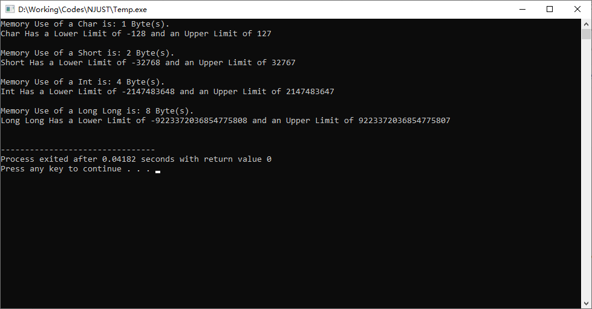

# [Updated 2024-10-11] 程序设计基础（I）总结

本文档是对2024年10月09日(星期三)及之后 蔡云飞老师 程序设计基础（I）课程的总结，仅供参考。

[TOC]

## 课前代码练习

### 2024-10-09 $A+B$问题

**[题目要求]**

定义两个字符形(char)变量$a = 1,b = 2$，输出这两个字符形变量之和的值。

**[输入说明]**

无

**[输出说明]**

输出这两个变量之和的值。

**[样例输入]**

(本题无输入内容)

**[样例输出]**

(写出正确的代码后运行即可得到)

---

不难写出这样的代码：

```C++
#include <iostream>
using namespace std;

int main()
{
    char a, b, c;
    
    a = 1;
    b = 2;
    c = a + b;
    
    cout << c << endl;
    return 0;
}
```

那么运行代码后会得到什么结果呢？


<center>运行这段代码得到的结果</center>

为什么我们得到了一个爱心符号而不是$a+b$的结果$3$呢？

**这里要注意我们定义的变量类型。**

课上有提到，因为我们的计算的数据和结果数值都很小，用char(可表示-128~127的数)即可存放。<font color = red>但char是字符形，使得最后在输出时输出的数值并非该变量的实际数值，而是对应该ASCII码值的字符，也就是这个爱心。</font>

那这种情况下我们应该怎么让它输出数值呢？让我们看看更改后的代码：

```C++
#include <iostream>
using namespace std;

int main()
{
    char a, b, c;
    
    a = 1;
    b = 2;
    c = a + b;
    
    cout << (int)c << endl;
    return 0;
}
```

这里我们将cout语句中的"c"改成了"(int)c"，即将c**强制转化为int形**后以整形输出，这样就能得到正确的结果了。


<center>运行这段代码得到的结果</center>

---

### 2024-10-11 $A\times B$问题 

**[题目描述]**

给定两个整数$A,B$，按规定的输出格式输出这两个整数的积。

**[输入说明]**

输入两个整数，保证输入的数据和它们的积均在32位整型范围内。

**[输出说明]**

用如下格式输出两个整数的积:

(如果输入的$A$是$2$, 输入的$B$是$3$)

```
2x3=6
```

**[样例输入]**

```
2 3
```

**[样例输出]**

```
2x3=6
```

---

有同学在看到题目要求后会打出这样的代码：

```C++
#include <iostream>
using namespace std;

int main()
{
    int a, b;
    cout >> "Please Input Two Integers: ";
    cin >> a >> b;
    cout >> "The Answer is: " >> a >> 'x' >> b >> '=' >> a * b;
    return 0;
}
```

这样写对用户非常友好，毕竟它提示并引导用户输入了数据，在运行的窗口中我们应该会看到这样的显示：

```
Please Input Two Integers: 2 3
The Answer is: 2x3=6
```

对于人工检查来说，这样的输出一目了然，但实际上对我们的程序进行判定的是**<font color = red>机器</font>**，而机器只会机械地对比我们输出的，和应当给出的输出是否一致。

我们来看看这个程序实际上输出了什么：

```
Please Input Two Integers: The Answer is: 2x3=6
```

符合题目要求的输出是：

```
2x3=6
```

两者并不一致，**<font color = red>所以说对于在线评测系统(Online Judge, 通常简称为OJ)来说，这个程序的输出并不符合要求。</font>**

**<big><font color = blue>所以，题目要求做什么，我们就只做题目要求的事情，不要自作主张输出题目要求以外的内容，否则将会被判定为错误答案。</font></big>**

那么，符合题目要求的代码应该是什么样的呢？

```C++
#include <iostream>
using namespace std;

int main()
{
    int a, b;
    cin >> a >> b;
    cout << a << 'x' << b << '=' << a * b << endl;
    return 0;
}
```

上面列出的是一个简单的例子，让大家了解OJ的工作原理。后续我们的上机考试应该都是使用这种方式进行评测，建议同学们先按照这种方式练习打代码，以防止在后续OJ提交时出现这样明明会做，但无法通过评测的情况。

---

## 上课内容总结

本部分是对上课内容的简单总结，可能会有遗漏，欢迎指出。

### 常用变量类型的占用空间大小、表示范围

|   类型名称   |       关键字       | 内存占用空间 |          表示范围          |
| :----------: | :----------------: | :----------: | :------------------------: |
|    字符形    |        char        |    1 Byte    |        $-128$~$127$        |
|    短整形    |       short        |    2 Byte    |      $-32768$~$32767$      |
|     整形     |        int         |    4 Byte    | $-2147483648$~$2147483647$ |
|    长整形    |     long long      |    8 Byte    |   $-2^{63}$~$(2^{63}-1)$   |
| 无符号字符形 |   unsigned char    |    1 Byte    |         $0$~$255$          |
| 无符号短整形 |   unsigned short   |    2 Byte    |        $0$~$65535$         |
|  无符号整形  |    unsigned int    |    4 Byte    |      $0$~$4294967295$      |
| 无符号长整形 | unsigned long long |    8 Byte    |      $0$~$(2^{64}-1)$      |
|    布尔形    |        bool        |    1 Byte    |   $0$(False), $1$(True)    |

在实际编程过程中可根据自己的实际需求选择所需要的变量类型进行存储和运算，并规避可能的溢出问题。

而这些数值上限并不需要我们严格记忆，在\<climits\>头文件中，我们可以找到这些数值的上下限，以下面的代码作为示例。

```C++
#include <iostream>
#include <climits>
using namespace std;

int main()
{
    cout << "Memory Use of a Char is: " << sizeof(char) << " Byte(s)." << endl;
    cout << "Char Has a Lower Limit of " << CHAR_MIN << " and an Upper Limit of " << CHAR_MAX << endl << endl;
    
    cout << "Memory Use of a Short is: " << sizeof(short) << " Byte(s)." << endl;
    cout << "Short Has a Lower Limit of " << SHRT_MIN << " and an Upper Limit of " << SHRT_MAX << endl << endl;
    
    cout << "Memory Use of a Int is: " << sizeof(int) << " Byte(s)." << endl;
    cout << "Int Has a Lower Limit of " << INT_MIN << " and an Upper Limit of " << INT_MAX << endl << endl;
    
    cout << "Memory Use of a Long Long is: " << sizeof(long long) << " Byte(s)." << endl;
    cout << "Long Long Has a Lower Limit of " << LLONG_MIN << " and an Upper Limit of " << LLONG_MAX << endl << endl;
    
    return 0;
}
```

这里我们可以看到这些变量的上下限值可以用常量的形式输出出来，同时sizeof(int)可以用来表示变量使用内存的大小(以字节为单位)。

运行得到的结果如下图所示：



<center>运行这段代码得到的结果</center>

### 变量命名规则

除不能与关键字、保留字重复外，开头只允许使用下划线或字母，并且变量名称(或称标识符)的其他位只能由下划线、字母和数字进行组合，**并区分大小写。**

### 算术运算符

| 符号 |                             作用                             |
| :--: | :----------------------------------------------------------: |
|  +   |                         计算两数之和                         |
|  -   |                         计算两数之差                         |
|  *   |                         计算两数之积                         |
|  /   |                         计算两数之商                         |
|  %   | 计算两数之**<font color = red>模</font>**，即做除法后取余数(例如5%4=1, 因为用4除5余数为1) |
|  ^   |             计算乘方(例如$2^{2}$在代码中写作2^2)             |

### 逻辑运算符

| 符号 |                       作用                       |
| :--: | :----------------------------------------------: |
|  &   |           对两个二进制数进行取"与"运算           |
|  \|  |         对两个二进制数进行逐位取"或"运算         |
|  ~   |            对数据的二进制补码逐位取反            |
|  !   |     若数字不是0，则置为0，若数字是0，则置为1     |
|  &&  | 对两侧条件进行且运算，**所得结果为真(1)或假(0)** |
| \|\| | 对两侧条件进行或运算，**所得结果为真(1)或假(0)** |

*需要注意的是，C++中，当数值的值不为0，即被视为真，为0则视为假。*

### 位运算符

| 符号 |                             作用                             |
| :--: | :----------------------------------------------------------: |
|  <<  | 将二进制**<font color = red>整</font>**数左移对应位数(例如0B1100 << 1=0B11000) |
|  >>  | 将二进制**<font color = red>整</font>**数右移对应位数(例如0B1101 >> 1=0B110) |

为了更好地理解这些运算符的作用，我们不妨直接写写代码来直观地看。

```C++
#include <iostream>
using namespace std;

int main()
{
    int a, b;
    
    // 先进行算术运算符的计算
    a = 100;
    b = 55;
    
    cout << a + b << endl << a - b << endl;
    cout << a * b << endl << a / b << endl;
    cout << a % b << endl << endl;
    
    // 再进行逻辑运算符的计算，为直观表现，我们使用二进制的方式
    // a = 0B1100100
    // b = 0B0110111
    
    cout << (a & b) << endl << (a | b) << endl;
    cout << ~a << endl << !a << endl;
    cout << (a && b) << endl << (a || b) << endl << endl;
    
    // 位运算
    
    cout << (a << 1) << endl;
    cout << (a >> 1) << endl;
    return 0;
}
```

运行这段代码，看看结果。

```
155
45
5500
1
45

36
119
-101
0
1
1

200
50
```

想一想位运算的结果, 再和下方的解释进行对比。

```
0B1100100 & 0B0110111 = 0B0100100 = 36
0B1100100 | 0B0110111 = 0B1110111 = 119
~0B1100100 = ~(0000 0000 0000 0000 0000 0000 0110 0100) = (1111 1111 1111 1111 1111 1111 1001 1011) = -101
[写为完整32位整形后对包括符号位的所有位的数据全部取反，其实际效果等同于将十进制数取负后再-1]

!0B1100100 = 0
[数字不为0，结果为0]

0B1100100 && 0B0110111 = 1
[两个数据都不是0，都表达为真，真且真为真(1)]

0B1100100 || 0B0110111 = 1
[两个数据都不是0，都表达为真，真或真为真(1)]

0B1100100 << 1 = 0B11001000 = 200
0B1100100 >> 1 = 0B110010 = 50
```

