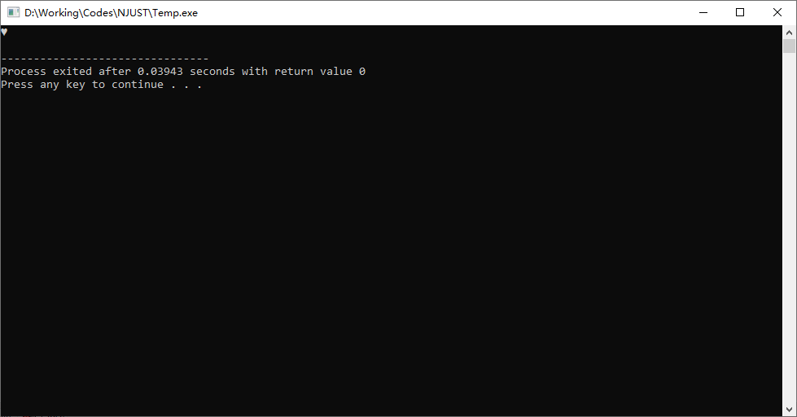
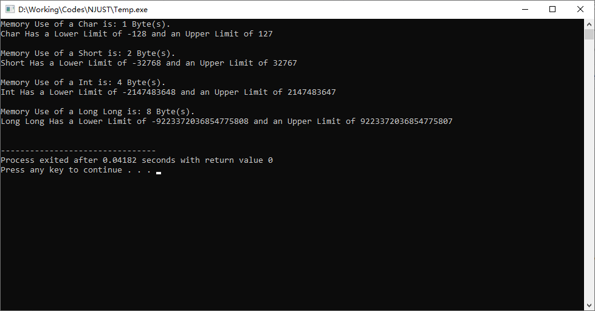

# [Updated 2024-10-18] 程序设计基础（I）总结

本文档是对2024年10月09日(星期三)及之后 蔡云飞老师 程序设计基础（I）课程的总结，仅供参考。

**<font color =red>[强调] 学习是自己的事情，上课之前请务必预习，上课之后请保持复习的习惯。如果出现两次课前追问答不上的情况，会有不良后果。</font>**

[TOC]

## 课后代码练习

### 提交说明

提交文件时Project名称为[x1_x2_x3],其中x1为章节号、x2为题号、x3为小题号。

例如2024年10月16日的Project文件夹名称为:

```
3_28_1
3_28_2
3_28_3
```

在**<font color = red>学期末</font>**时将整个Workspace下所有按该此标准写的代码打包为[学号-姓名]的压缩包，并将其**<font color = red>通过邮箱</font>**发送至erzhang@njust.edu.cn。

>   如果不知道如何进行压缩，请点击[这个链接](https://www.bandisoft.com/bandizip/)进入Bandizip官网，点击页面中的"下载Bandizip安装包"按钮。
>
>   下载完成后双击"BANDIZIP-SETUP-STD-X64.EXE"文件安装Bandizip软件。
>
>   完成安装后，选中所有需要压缩的文件夹，并在右键菜单中选择"压缩为...zip"选项，即可完成压缩操作。

压缩包文件名示例:

```
924106840341-张恩溶.zip
```

>   <font color = red>注意这里的"-"是减号，不是破折号</font>

<font color = red>在提交代码时，请保证每个Project文件夹下仅保留.cpp和.h文件，将其他文件删除。</font>

### 课后作业布置记录

[2024-10-16] 作业 [Pg. 67 - 28题]

[2024-10-18] 作业 [Pg.89 - 11题]

## 课前代码练习

### 2024-10-09 $A+B$问题

**[题目要求]**

定义两个字符形(char)变量$a = 1,b = 2$，输出这两个字符形变量之和的值。

**[输入说明]**

无

**[输出说明]**

输出这两个变量之和的值。

**[样例输入]**

(本题无输入内容)

**[样例输出]**

(写出正确的代码后运行即可得到)

---

不难写出这样的代码：

```C++
#include <iostream>
using namespace std;

int main()
{
    char a, b, c;
    
    a = 1;
    b = 2;
    c = a + b;
    
    cout << c << endl;
    return 0;
}
```

那么运行代码后会得到什么结果呢？



<center>运行这段代码得到的结果</center>

为什么我们得到了一个爱心符号而不是$a+b$的结果$3$呢？

**这里要注意我们定义的变量类型。**

课上有提到，因为我们的计算的数据和结果数值都很小，用char(可表示-128~127的数)即可存放。<font color = red>但char是字符形，使得最后在输出时输出的数值并非该变量的实际数值，而是对应该ASCII码值的字符，也就是这个爱心。</font>

那这种情况下我们应该怎么让它输出数值呢？让我们看看更改后的代码：

```C++
#include <iostream>
using namespace std;

int main()
{
    char a, b, c;
    
    a = 1;
    b = 2;
    c = a + b;
    
    cout << (int)c << endl;
    return 0;
}
```

这里我们将cout语句中的"c"改成了"(int)c"，即将c**强制转化为int形**后以整形输出，这样就能得到正确的结果了。


<center>运行这段代码得到的结果</center>

---

### 2024-10-11 $A\times B$问题 

**[题目描述]**

给定两个整数$A,B$，按规定的输出格式输出这两个整数的积。

**[输入说明]**

输入两个整数，保证输入的数据和它们的积均在32位整型范围内。

**[输出说明]**

用如下格式输出两个整数的积:

(如果输入的$A$是$2$, 输入的$B$是$3$)

```
2x3=6
```

**[样例输入]**

```
2 3
```

**[样例输出]**

```
2x3=6
```

---

有同学在看到题目要求后会打出这样的代码：

```C++
#include <iostream>
using namespace std;

int main()
{
    int a, b;
    cout >> "Please Input Two Integers: ";
    cin >> a >> b;
    cout >> "The Answer is: " >> a >> 'x' >> b >> '=' >> a * b;
    return 0;
}
```

这样写对用户非常友好，毕竟它提示并引导用户输入了数据，在运行的窗口中我们应该会看到这样的显示：

```
Please Input Two Integers: 2 3
The Answer is: 2x3=6
```

对于人工检查来说，这样的输出一目了然，但实际上对我们的程序进行判定的是**<font color = red>机器</font>**，而机器只会机械地对比我们输出的，和应当给出的输出是否一致。

我们来看看这个程序实际上输出了什么：

```
Please Input Two Integers: The Answer is: 2x3=6
```

符合题目要求的输出是：

```
2x3=6
```

两者并不一致，**<font color = red>所以说对于在线评测系统(Online Judge, 通常简称为OJ)来说，这个程序的输出并不符合要求。</font>**

**<big><font color = blue>所以，题目要求做什么，我们就只做题目要求的事情，不要自作主张输出题目要求以外的内容，否则将会被判定为错误答案。</font></big>**

那么，符合题目要求的代码应该是什么样的呢？

```C++
#include <iostream>
using namespace std;

int main()
{
    int a, b;
    cin >> a >> b;
    cout << a << 'x' << b << '=' << a * b << endl;
    return 0;
}
```

上面列出的是一个简单的例子，让大家了解OJ的工作原理。后续我们的上机考试应该都是使用这种方式进行评测，建议同学们先按照这种方式练习打代码，以防止在后续OJ提交时出现这样明明会做，但无法通过评测的情况。

---

### 2024-10-18 分离整数与小数

**[题目描述]**

给定一个浮点数，输出它的整数部分和小数部分。

**[输入说明]**

输入一个浮点数。

**[输出说明]**

分别输出这个浮点数的整数部分和小数部分，用空格分隔。

**[样例输入]**

```
-32767.65536
```

**[样例输出]**

```
-32767 -0.65536
```

---

<font color = red>本题为作业，不进行完整代码演示。仅对其中比较重要的内容进行说明。</font>

#### 浮点数的存储

对于一个浮点数而言，其在计算机内的存储是以科学计数法的方式进行的，那么如果要判定两个浮点数相等，最好的方式是使用极限的定义，即：

取足够小的值$\epsilon$，当两个浮点数的差值小于$\epsilon$即可认为两个浮点数相等。

#### 输出流的控制

见教材Pg. 509页，其中对cout输出流的格式控制中，当在头文件中加入\<iomanip\>头文件后，可以通过使用setprecision(int)控制浮点数输出的精度，追加fixed是指setprecision(int)中int的值为小数点后的位数，。

> 不难理解"iomanip"的意思，其名称是Input Output Manipulation(输入输出控制)

如下为一段示例代码：

```C++
#include <iostream>
#include <iomanip>
using namespace std;

int main()
{
    double	a = 32767.65536;
    cout << a << endl;
    cout << fixed << setprecision(2) << a << endl;
    return 0;
}
```

运行这段代码得到的结果是：

```
32767.7
32767.66
```

## 上课内容总结

本部分是对上课内容的简单总结，可能会有遗漏，欢迎指出。

### 常用变量类型的占用空间大小、表示范围

|   类型名称   |       关键字       | 内存占用空间 |          表示范围          |
| :----------: | :----------------: | :----------: | :------------------------: |
|    字符形    |        char        |    1 Byte    |        $-128$~$127$        |
|    短整形    |       short        |    2 Byte    |      $-32768$~$32767$      |
|     整形     |        int         |    4 Byte    | $-2147483648$~$2147483647$ |
|    长整形    |     long long      |    8 Byte    |   $-2^{63}$~$(2^{63}-1)$   |
| 无符号字符形 |   unsigned char    |    1 Byte    |         $0$~$255$          |
| 无符号短整形 |   unsigned short   |    2 Byte    |        $0$~$65535$         |
|  无符号整形  |    unsigned int    |    4 Byte    |      $0$~$4294967295$      |
| 无符号长整形 | unsigned long long |    8 Byte    |      $0$~$(2^{64}-1)$      |
|    布尔形    |        bool        |    1 Byte    |   $0$(False), $1$(True)    |

在实际编程过程中可根据自己的实际需求选择所需要的变量类型进行存储和运算，并规避可能的溢出问题。

而这些数值上限并不需要我们严格记忆，在\<climits\>头文件中，我们可以找到这些数值的上下限，以下面的代码作为示例。

```C++
#include <iostream>
#include <climits>
using namespace std;

int main()
{
    cout << "Memory Use of a Char is: " << sizeof(char) << " Byte(s)." << endl;
    cout << "Char Has a Lower Limit of " << CHAR_MIN << " and an Upper Limit of " << CHAR_MAX << endl << endl;
    
    cout << "Memory Use of a Short is: " << sizeof(short) << " Byte(s)." << endl;
    cout << "Short Has a Lower Limit of " << SHRT_MIN << " and an Upper Limit of " << SHRT_MAX << endl << endl;
    
    cout << "Memory Use of a Int is: " << sizeof(int) << " Byte(s)." << endl;
    cout << "Int Has a Lower Limit of " << INT_MIN << " and an Upper Limit of " << INT_MAX << endl << endl;
    
    cout << "Memory Use of a Long Long is: " << sizeof(long long) << " Byte(s)." << endl;
    cout << "Long Long Has a Lower Limit of " << LLONG_MIN << " and an Upper Limit of " << LLONG_MAX << endl << endl;
    
    return 0;
}
```

这里我们可以看到这些变量的上下限值可以用常量的形式输出出来，同时sizeof(int)可以用来表示变量使用内存的大小(以字节为单位)。

运行得到的结果如下图所示：



<center>运行这段代码得到的结果</center>

### 变量命名规则

除不能与关键字、保留字重复外，开头只允许使用下划线或字母，并且变量名称(或称标识符)的其他位只能由下划线、字母和数字进行组合，**并区分大小写。**

### 算术运算符

| 符号 |                             作用                             |
| :--: | :----------------------------------------------------------: |
|  +   |                         计算两数之和                         |
|  -   |                         计算两数之差                         |
|  *   |                         计算两数之积                         |
|  /   |                         计算两数之商                         |
|  %   | 计算两数之**<font color = red>模</font>**，即做除法后取余数(例如5%4=1, 因为用4除5余数为1) |
|  ^   |             计算乘方(例如$2^{2}$在代码中写作2^2)             |

### 逻辑运算符

| 符号 |                       作用                       |
| :--: | :----------------------------------------------: |
|  &   |           对两个二进制数进行取"与"运算           |
|  \|  |         对两个二进制数进行逐位取"或"运算         |
|  ~   |            对数据的二进制补码逐位取反            |
|  !   |     若数字不是0，则置为0，若数字是0，则置为1     |
|  &&  | 对两侧条件进行且运算，**所得结果为真(1)或假(0)** |
| \|\| | 对两侧条件进行或运算，**所得结果为真(1)或假(0)** |

*需要注意的是，C++中，当数值的值不为0，即被视为真，为0则视为假。*

### 位运算符

| 符号 |                             作用                             |
| :--: | :----------------------------------------------------------: |
|  <<  | 将二进制**<font color = red>整</font>**数左移对应位数(例如0B1100 << 1=0B11000) |
|  >>  | 将二进制**<font color = red>整</font>**数右移对应位数(例如0B1101 >> 1=0B110) |

为了更好地理解这些运算符的作用，我们不妨直接写写代码来直观地看。

```C++
#include <iostream>
using namespace std;

int main()
{
    int a, b;
    
    // 先进行算术运算符的计算
    a = 100;
    b = 55;
    
    cout << a + b << endl << a - b << endl;
    cout << a * b << endl << a / b << endl;
    cout << a % b << endl << endl;
    
    // 再进行逻辑运算符的计算，为直观表现，我们使用二进制的方式
    // a = 0B1100100
    // b = 0B0110111
    
    cout << (a & b) << endl << (a | b) << endl;
    cout << ~a << endl << !a << endl;
    cout << (a && b) << endl << (a || b) << endl << endl;
    
    // 位运算
    
    cout << (a << 1) << endl;
    cout << (a >> 1) << endl;
    return 0;
}
```

运行这段代码，看看结果。

```
155
45
5500
1
45

36
119
-101
0
1
1

200
50
```

想一想位运算的结果, 再和下方的解释进行对比。

```
0B1100100 & 0B0110111 = 0B0100100 = 36
0B1100100 | 0B0110111 = 0B1110111 = 119
~0B1100100 = ~(0000 0000 0000 0000 0000 0000 0110 0100) = (1111 1111 1111 1111 1111 1111 1001 1011) = -101
[写为完整32位整形后对包括符号位的所有位的数据全部取反，其实际效果等同于将十进制数取负后再-1]

!0B1100100 = 0
[数字不为0，结果为0]

0B1100100 && 0B0110111 = 1
[两个数据都不是0，都表达为真，真且真为真(1)]

0B1100100 || 0B0110111 = 1
[两个数据都不是0，都表达为真，真或真为真(1)]

0B1100100 << 1 = 0B11001000 = 200
0B1100100 >> 1 = 0B110010 = 50
```

### 条件运算符

在书写赋值语句时会用到，我们来看以下代码：

```C++
#include <iostream>
using namespace std;

int main()
{
    int a, b, c;
    
    a = 1;
    b = 2;
    c = (a > b) ? a : b;
    
    cout << c << endl;
    return 0;
}
```

这里出现了一个比较奇怪的赋值语句。

```C++
c = (a > b) ? a : b;
```

在运行过程中，这个语句的执行逻辑是，判断$a>b$是否为真，如果为真，则将$a$的值赋给$c$，如果为假，则把$b$的值赋给$c$。

那么我们运行这段代码得到的结果是：

```
2
```

本质上这段代码的执行逻辑可以等同于下列代码：

```C++
if (a > b)
{
    c = a;
}
else
{
    c = b;
}
```

上课时的例程代码更有意思，我们来看看：

```c++
#include <iostream>
using namespace std;

int main()
{
	int a;
	cin >> a;
	a = (a > 0) ? a : (-a);
	cout << a << endl;
	return 0;
}
```

想一想，这样的代码执行效果是什么呢？

### 赋值运算符

| 符号 |                         作用                         |  示例  |                  备注                  |
| :--: | :--------------------------------------------------: | :----: | :------------------------------------: |
|  =   |     将表达式右侧的**值**赋给表达式左侧的**变量**     | a = 2  |                                        |
|  +=  |    将表达式右侧的**值**加到表达式左侧的**变量**中    | a += 2 | 等同于a = a + 2，其效果为将a的值增加2  |
|  -=  | 将表达式右侧的**值**取负后加到表达式左侧的**变量**中 | a -= 2 | 等同于a = a - 2，其效果为将a的值减少2  |
|  *=  |    将表达式右侧的**值**乘到表达式左侧的**变量**中    | a *= 3 | 等同于 a = a * 3，其效果为将a的值乘3倍 |
|  /=  |      用表达式右侧的**值**除表达式左侧的**变量**      | a /= 2 |    等同于 a = a / 2，其效果为用2除a    |
|  %=  |    用表达式右侧的**值**对表达式左侧的**变量**取模    | a %= 2 |  等同于 a = a % 2，其效果为用2对a取模  |
|  &=  |     将表达式两侧的值进行按位与运算后赋给左侧变量     | a &= 1 |            等同于 a = a & 1            |

> 当表达式两侧的变量类型不同时，请务必注意**在变量类型发生转换时发生的高位截断，或浮点数转整数损失小数位**的问题。

还是以代码进行示例。

``` C++
#include <iostream>
using namespace std;

int main()
{
    unsigned int	a = 0x0f123c5b;
    unsigned char	b;
    
    b = a;
    
    cout << hex << (int)b << endl;
    
    double			c = 32767.65536;
    int				d;
    
    d = c;
    
    cout << dec << d << endl;
    return 0;
}
```

我们知道unsigned int型占用长度是4个字节，而unsigned char型仅占1个字节，那么在进行赋值时，会将unsigned int型舍去前3个字节的值后将剩余的值存入unsigned char型，而浮点数则会读值后仅保留整数赋给d。

那我们运行程序看看输出的结果。

```
5b
32767
```

这个时候就有聪明的同学要问了，取整是怎么取的呢，如果浮点数是负数要怎么办呢？

**不妨直接改代码看看。**

```C++
#include <iostream>
using namespace std;

int main()
{
    double	c = -32767.65536;
    int		d;
    
    d = c;
    
    cout << d << endl;
    return 0;
}
```

运行结果是：

```
-32767
```

所以，以这段代码为例，我们可以知道，对负数的浮点数，将其转换为整型时**并非**向下取整，而是只保留其整型的部分。

### 逗号运算符

```C++
int a = 10;
int b = 20;
int c = 30;
```

可以写成这样：

```C++
int a = 10, b = 20, c = 30;
```

注意代码的执行顺序是从左到右执行，所以在书上我们就可以看到这样的**坑逼**代码(<font color = red>要能看懂，但自己别主动写这样的疑惑代码，否则会被打</font>)

```C++
#include <iostream>
using namespace std;

int main()
{
	int a = 10;
	int b = 20;
	int c = a, b + 5;
    
    cout << c << endl;
    
    return 0;
}
```

运行的结果是：

```
25
```

在运行时，CPU先将$a$的值读入缓存中，随后将$b$读入缓存，对其进行$b+5$运算后赋给$c$。

### 自增自减运算符

> 在单独成为一个语句时，a++和++a等价，重点是在赋值或判断的过程的先后顺序。
>
> 对于a++，这个语句会先将a进行赋值或判断，再对a进行自增操作。

同样以代码示例：

```C++
#include <iostream>
using namespace std;

int main()
{
    int	a = 1;
    
    cout << a++ << endl;
    cout << ++a << endl;
    
    return 0;
}
```

其运行结果是：

```
1
3
```

### sizeof运算符

丈量变量**类型**所占内存，其值以字节为单位，在之前的总结中已经有提到过。

### typeid运算符

获得变量所属类型。

还是用代码示例：

```C++
#include <iostream>
#include <typeinfo>
using namespace std;

int main()
{
    int a;
    cout << typeid(a).name() << endl;
    return 0;
}
```

其输出结果是：(根据编译器不同有不同输出，如下是Dev Cpp使用GCC输出的值)

```
i
```

### 类型转换

#### 隐式类型转换

(自动完成，当赋值语句两侧类型不同时会将类型转换为相同，随后计算赋值，前文已有提到，此处不再做额外说明，详细内容见书)

#### 显式类型转换

(人工指定类型进行转换，在之前10月09日的上机练习中已经出现过，不再重复说明)

### 顺序语句

我们之前写的所有代码都是顺序语句，即按顺序执行的语句，此处不多额外说明。

### 选择语句

#### if-else语句

可以表示为(下方为伪代码)：

```C++
if(Condition 1 Met)
{
	//Do Something
}
else if(Condition 2 Met) // Condition 1 is False, but Condition 2 is True
{
    //Do Something
}
else // Neither Condition 1 nor Condition 2 is True
{
    // Do Something
}
```

用这样的语句形式可以套很多条件，不仅限于两个条件。

示例程序：对学生成绩进行分级。

```C++
#include <iostream>
using namespace std;

int main()
{
    double score;
    
    cin >> score;
    if(score > 100 || score < 0)
    {
        cout << "Invalid Input" << endl;
    }
    else if(score >= 90)
    {
        cout << "Grade: A" << endl;
    }
    else if(score >= 80)
    {
        cout << "Grade: B" << endl;
    }
    else if(score >= 70)
    {
        cout << "Grade: C" << endl;
    }
    else if(score >= 60)
    {
        cout << "Grade: D" << endl;
    }
    else
    {
        cout << "Grade: E(Fail)" << endl;
    }
    
    return 0;
}
```

这个时候就有同学要问了，为什么我不在第一个else if语句处判定(score <= 100)呢？

因为代码执行第一个else if语句时，<font color = red>已经执行过if(score > 100 || score < 0)的判断，且这个条件不为真</font>，那么进行 else if(score >=90) 判断时，已经确认score<=100且score>=0，没有必要再将其写入条件。

#### switch语句

枚举可能出现的值，并依枚举出的值对其进行判断，为了防止出现在执行过程中改变被判断变量的问题，在每个情况下执行完相应操作后都要写break语句。

我们来看一个错误示例。

```C++
#include <iostream>
using namespace std;

int main()
{
	int score	= 100;
    
    switch(score/10)
    {
        case 10:
        case 9:
            cout << "A" << endl;
        case 8:
            cout << "B" << endl;
        case 7:
            cout << "C" << endl;
        case 6:
            cout << "D" << endl;
        default:
            cout << "Fail" << endl;
    }
    return 0;
}
```

这段代码输出的结果是：

```
A
B
C
D
Fail
```

显然不是我们想要的结果，这就是因为swtich语句中不遇break不会跳出语句块，导致将下面的语句全部执行。

那么修改正确的代码是：

```
#include <iostream>
using namespace std;

int main()
{
	int score	= 100;
    
    switch(score/10)
    {
        case 10:
        case 9:
            cout << "A" << endl;
            break;
        case 8:
            cout << "B" << endl;
            break;
        case 7:
            cout << "C" << endl;
            break;
        case 6:
            cout << "D" << endl;
            break;
        default:
            cout << "Fail" << endl;
            break;
    }
    return 0;
}
```

这次的输出是：

```
A
```

符合要求。

#### 调试

在Dev Cpp中，如要调试代码，可在代码中打上断点后点击上方的对勾按钮进行调试。

调试过程中可添加查看，以查看变量的值在代码运行过程中的变化情况。

如在调试过程中遇到闪退的情况，请参见[这篇文章](https://blog.csdn.net/qq_44723773/article/details/104299866)和[这篇文章](https://www.cnblogs.com/eesoft/p/15609793.html)。

### 循环语句

对于反复执行的语句，我们可以使用循环语句执行。

#### for循环

格式如下：

```C++
for ([初始条件]; [目标条件]; [递增语句])
    //Do Sth
```

初始条件：即为循环开始的条件；

目标条件：即为循环结束的条件；

递增条件：即为循环进行过程中，每执行一次循环体后执行的操作，通常为使循环变量自增。

示例代码：(输出从1-10的所有数字，每个数字单独一行)

```C++
#include <iostream>
using namespace std;

int main()
{
    for (int i = 0; i < 10; i++)
    {
        cout << i + 1 << endl;
    }
    return 0;
}
```

运行这段代码得到的结果是：

```
1
2
3
4
5
6
7
8
9
10
```

这里需要注意的是，为什么我会选择让$i$从0开始，而不是从1开始呢？

> 我们知道，计算机内，数字是从0开始递增，而不是从1开始递增，所以对于一个十个元素的数组(之后会遇到)a[10]，其数组的下标是a[0], a[1], a[2], a[3], ..., a[9].
>
> 所以同样是执行十次，让循环变量从0开始执行时，会更符合数组下标的变化情况，从而防止可能出现的数组下标越界导致的程序异常。

还有一个问题，一定要写满三个条件吗？

答案是可以选择性地留空，比如初始条件在循环体外定义，自增操作在循环体内进行等。

但一定要注意不要让循环成为死循环（即不可能结束的无限执行的循环，如果没有在for循环的括号中定义目标条件，那就一定要在循环体中通过条件语句判断并使用break语句跳出循环）。

上课例程：通过for循环的嵌套，输出九九乘法表：

```C++
#include <iostream>
using namespace std;

int main()
{
    for(int i = 0; i < 9; i++)
    {
        for (int j = 0; j <= i; j++)
        {
            cout << (i + 1) << '*' << (j + 1) << '=' << (i + 1) * (j + 1);
            if (j != i)
            {
                cout << '\t';
            }
        }
        cout << endl;
    }
    return 0;
}
```

输出结果是

```
1*1=1
2*1=2   2*2=4
3*1=3   3*2=6   3*3=9
4*1=4   4*2=8   4*3=12  4*4=16
5*1=5   5*2=10  5*3=15  5*4=20  5*5=25
6*1=6   6*2=12  6*3=18  6*4=24  6*5=30  6*6=36
7*1=7   7*2=14  7*3=21  7*4=28  7*5=35  7*6=42  7*7=49
8*1=8   8*2=16  8*3=24  8*4=32  8*5=40  8*6=48  8*7=56  8*8=64
9*1=9   9*2=18  9*3=27  9*4=36  9*5=45  9*6=54  9*7=63  9*8=72  9*9=81
```

#### while和do-while循环

相比for循环，while循环更加简单，其格式为：

```C++
while(条件)
{
    // Do Sth
}
```

当符合条件时，即执行循环体中的语句。注意是**先判断，再执行**。

另一种是do-while，相比while语句，它是**先执行，再判断**。

```C++
do
{
	// Do Sth
}while(条件)
```

示例程序：

```C++
#include <iostream>
using namespace std;

int main()
{
	int i = 0;
	
	while(i < 10)
    {
        cout << (i + 1) << ' ';
        i++;
    }
    
    do
    {
        cout << (i + 1) << ' ';
        i++;
    }while(i < 10);
    return 0;
}
```

输出结果：

```
1 2 3 4 5 6 7 8 9 10 11
```

想想为什么最后会输出11.

#### break和continue

break代表直接终止循环，而continue则跳过后续代码，直接进入下一次循环。

示例代码：

```C++
#include <iostream>
using namespace std;

int main()
{
    for (int i = 0; i < 10; i++)
    {
        if (i == 3)
        {
            continue;
        }
        cout << (i + 1) << ' ';
    }
    cout << endl;
    
    for (int i = 0; i < 10; i++)
    {
        if (i == 3)
        {
            break;
        }
        cout << (i + 1) << ' ';
    }
    return 0;
}
```

运行结果为：

```
1 2 3 5 6 7 8 9 10
1 2 3
```

思考这个运行结果的原因。

### 例题选讲

#### [Pg. 85] 例4.11

写法不唯一，可用于参考思路。

```C++
#include <iostream>
using namespace std;

int a;

int main()
{
    cin >> a;
    
    while (a)	// 等效于 while(a != 0)
    {
        if (a < 0)
        {
            cout << "Invalid Input, Please Input A POSITIVE Integer." << endl;
            cin >> a;
            continue;
        }
        
        while (a)
        {
            cout << a % 10;
            a /= 10;
        }
        
        cout << endl;
        cin >> a;
    }
    return 0;
}
```

#### [Pg. 86] 例4.12

写法不唯一，可用于参考思路。

```C++
#include <iostream>
using namespace std;

int main()
{
    for (int i = 1; i <= (100 / 5); i++)
    {
        for (int j = 1; (5 * i) + (3 * j) <= 100; j++)
        {
            for (int k = 3; (5 * i) + (3 * j) + (k / 3) <= 100; k += 3)
            {
                if ((5 * i + 3 * j + k / 3 == 100) && (i + j + k == 100))
                {
                    cout << i << ' ' << j << ' ' << k << endl;
                }
            }
        }
    }
    return 0;
}
```

*(暴力枚举答案)*
