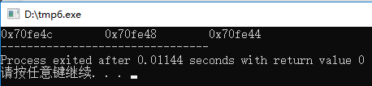

# [Updated 2024-11-08] 程序设计基础（I）总结

本文档是对2024年10月09日(星期三)及之后 蔡云飞老师 程序设计基础（I）课程的总结，仅供参考。

**<font color =red>[强调] 学习是自己的事情，上课之前请务必预习，上课之后请保持复习的习惯。如果出现两次课前追问答不上的情况，会有不良后果。</font>**

[TOC]

## 课后代码练习

### 提交说明

提交文件时Project名称为[x1_x2_x3],其中x1为章节号、x2为题号、x3为小题号。

例如2024年10月16日的Project文件夹名称为:

```
3_28_1
3_28_2
3_28_3
```

在**<font color = red>学期末</font>**时将整个Workspace下所有按该此标准写的代码打包为[学号-姓名]的压缩包，并将其**<font color = red>通过邮箱</font>**发送至erzhang@njust.edu.cn。

>   如果不知道如何进行压缩，请点击[这个链接](https://www.bandisoft.com/bandizip/)进入Bandizip官网，点击页面中的"下载Bandizip安装包"按钮。
>
>   下载完成后双击"BANDIZIP-SETUP-STD-X64.EXE"文件安装Bandizip软件。
>
>   完成安装后，选中所有需要压缩的文件夹，并在右键菜单中选择"压缩为...zip"选项，即可完成压缩操作。

压缩包文件名示例:

```
924106840341-张恩溶.zip
```

>   <font color = red>注意这里的"-"是减号，不是破折号</font>

<font color = red>在提交代码时，请保证每个Project文件夹下仅保留.cpp和.h文件，将其他文件删除。</font>

### 课后作业布置记录

[2024-10-16] 作业 [Pg. 67 - 28题]

[2024-10-18] 作业 [Pg. 89 - 11题]

[2024-11-01] 作业 [Pg. 137 21题]

## 课前代码练习

### 2024-10-09 $A+B$问题

**[题目要求]**

定义两个字符形(char)变量$a = 1,b = 2$，输出这两个字符形变量之和的值。

**[输入说明]**

无

**[输出说明]**

输出这两个变量之和的值。

**[样例输入]**

(本题无输入内容)

**[样例输出]**

(写出正确的代码后运行即可得到)

---

不难写出这样的代码：

```C++
#include <iostream>
using namespace std;

int main()
{
    char a, b, c;
    
    a = 1;
    b = 2;
    c = a + b;
    
    cout << c << endl;
    return 0;
}
```

那么运行代码后会得到什么结果呢？


<center>运行这段代码得到的结果</center>

为什么我们得到了一个爱心符号而不是$a+b$的结果$3$呢？

**这里要注意我们定义的变量类型。**

课上有提到，因为我们的计算的数据和结果数值都很小，用char(可表示-128~127的数)即可存放。<font color = red>但char是字符形，使得最后在输出时输出的数值并非该变量的实际数值，而是对应该ASCII码值的字符，也就是这个爱心。</font>

那这种情况下我们应该怎么让它输出数值呢？让我们看看更改后的代码：

```C++
#include <iostream>
using namespace std;

int main()
{
    char a, b, c;
    
    a = 1;
    b = 2;
    c = a + b;
    
    cout << (int)c << endl;
    return 0;
}
```

这里我们将cout语句中的"c"改成了"(int)c"，即将c**强制转化为int形**后以整形输出，这样就能得到正确的结果了。


<center>运行这段代码得到的结果</center>

---

### 2024-10-11 $A\times B$问题 

**[题目描述]**

给定两个整数$A,B$，按规定的输出格式输出这两个整数的积。

**[输入说明]**

输入两个整数，保证输入的数据和它们的积均在32位整型范围内。

**[输出说明]**

用如下格式输出两个整数的积:

(如果输入的$A$是$2$, 输入的$B$是$3$)

```
2x3=6
```

**[样例输入]**

```
2 3
```

**[样例输出]**

```
2x3=6
```

---

有同学在看到题目要求后会打出这样的代码：

```C++
#include <iostream>
using namespace std;

int main()
{
    int a, b;
    cout >> "Please Input Two Integers: ";
    cin >> a >> b;
    cout >> "The Answer is: " >> a >> 'x' >> b >> '=' >> a * b;
    return 0;
}
```

这样写对用户非常友好，毕竟它提示并引导用户输入了数据，在运行的窗口中我们应该会看到这样的显示：

```
Please Input Two Integers: 2 3
The Answer is: 2x3=6
```

对于人工检查来说，这样的输出一目了然，但实际上对我们的程序进行判定的是**<font color = red>机器</font>**，而机器只会机械地对比我们输出的，和应当给出的输出是否一致。

我们来看看这个程序实际上输出了什么：

```
Please Input Two Integers: The Answer is: 2x3=6
```

符合题目要求的输出是：

```
2x3=6
```

两者并不一致，**<font color = red>所以说对于在线评测系统(Online Judge, 通常简称为OJ)来说，这个程序的输出并不符合要求。</font>**

**<big><font color = blue>所以，题目要求做什么，我们就只做题目要求的事情，不要自作主张输出题目要求以外的内容，否则将会被判定为错误答案。</font></big>**

那么，符合题目要求的代码应该是什么样的呢？

```C++
#include <iostream>
using namespace std;

int main()
{
    int a, b;
    cin >> a >> b;
    cout << a << 'x' << b << '=' << a * b << endl;
    return 0;
}
```

上面列出的是一个简单的例子，让大家了解OJ的工作原理。后续我们的上机考试应该都是使用这种方式进行评测，建议同学们先按照这种方式练习打代码，以防止在后续OJ提交时出现这样明明会做，但无法通过评测的情况。

---

### 2024-10-18 分离整数与小数

**[题目描述]**

给定一个浮点数，输出它的整数部分和小数部分。

**[输入说明]**

输入一个浮点数。

**[输出说明]**

分别输出这个浮点数的整数部分和小数部分，用空格分隔。

**[样例输入]**

```
-32767.65536
```

**[样例输出]**

```
-32767 -0.65536
```

---

<font color = red>本题为作业，不进行完整代码演示。仅对其中比较重要的内容进行说明。</font>

#### 浮点数的存储

对于一个浮点数而言，其在计算机内的存储是以科学计数法的方式进行的，那么如果要判定两个浮点数相等，最好的方式是使用极限的定义，即：

取足够小的值$\epsilon$，当两个浮点数的差值小于$\epsilon$即可认为两个浮点数相等。

#### 输出流的控制

见教材Pg. 509页，其中对cout输出流的格式控制中，当在头文件中加入\<iomanip\>头文件后，可以通过使用setprecision(int)控制浮点数输出的精度，追加fixed是指setprecision(int)中int的值为小数点后的位数，。

> 不难理解"iomanip"的意思，其名称是Input Output Manipulation(输入输出控制)

如下为一段示例代码：

```C++
#include <iostream>
#include <iomanip>
using namespace std;

int main()
{
    double	a = 32767.65536;
    cout << a << endl;
    cout << fixed << setprecision(2) << a << endl;
    return 0;
}
```

运行这段代码得到的结果是：

```
32767.7
32767.66
```

### 2024-10-25 100以内的素数之和

 **[题目要求]**

输出100以内的所有素数之和

**[输入格式]**

无

**[输出格式]**

输出一行整数，表示100以内所有素数之和

**[样例输入]**

无

**[样例输出]**

*(正确编写程序后即可输出答案)*

---

这道题的重点在于如何判定一个数是否为素数。

我们知道素数是仅能被1及其本身整除的数，所以我们要对素数进行单独验证。

让我们来看一看这样的代码：

```C++
#include <iostream>
using namespace std;

int main()
{
	int n_Ans	= 0;
	
	for (int i = 2; i <= 100; i++)
	{
		int	n_Flag	= 1;
		for (int j = 2; j * j <= i; j++)
		{
			if(!(i % j))
			{
				n_Flag	= 0;
				break;
			}
		}
		
		if(n_Flag)
		{
			n_Ans	+= i;
		}
	}
	
	cout << n_Ans << endl;
	
	return 0;
}
```

这里有聪明的同学要问了，为什么内层嵌套的循环中，循环的条件为$j \times j \leq i$呢？

如果一个数不是素数，其最大的因子就是其平方根，所以大于其平方根的整数我们并不需要做判定，用这样的方式我们可以减少判定的次数，以达到提升程序运行效率的目的。

我们再来看看老师的例程：

```C++
#include <iostream>
using namespace std;

int main()
{
	int sum = 0;
	
	for (int i = 2; i <= 100; i++)
	{
		if (i == 2)
		{
			sum += i;
			continue;
		}
		
		for (int j = 2; j <= i; j++)
		{
			if (i == j)
			{
				sum += i;
			}
			
			if (i % j == 0)
			{
				break;
			}
		}
	}
	
	cout << sum << endl;
	
	return 0;
}
```

这样额外增加的判断逻辑不仅没有减小执行代码的时间复杂度，而且还因为复杂的逻辑增加了犯错的可能，对于代码的排错来说是不利的(这是已经修正好后的代码，可以对比一下两份代码的逻辑)。

---

### 2024-10-25 求一个数的所有质因子

 **[题目要求]**

输入一个正整数$A$，保证$A\leq 2000$，求出这个数的所有质因子，并将其质因子从小到大输出。

**[输入格式]**

一个整数$A$

**[输出格式]**

从小到大输出$A$的质因子，以空格隔开

**[样例输入]**

```
6
```

**[样例输出]**

```
2 3
```

---

判定素数的方式与上一道题相同，注意求其因子和求其是否为质因子的区别。

```C++
#include <iostream>
using namespace std;

int main()
{
	int	n_Num;
	
	cin >> n_Num;
	
	for (int i = 2; i <= n_Num; i++)
	{
		if (!(n_Num % i))
		{
			int	n_Flag	= 1;
			for (int j = 2; j * j <= i; j++)
			{
				if (!(i % j))
				{
					n_Flag	= 0;
					break;
				}
			}
			if (n_Flag)
			{
				cout << i << " ";
			}
		}
	}
	
	cout << endl;
	return 0;
}
```

### 2024-10-30 函数编写

**[题目要求]**

写出4个函数，分别求传入的两个整数、传入的三个整数、传入的四个整数的和，以及求从第一个整数到第二个整数之间所有数字之和。

---

根据题目要求，我们不难写出这样的代码(因未对主函数中的输入和输出进行说明，我们只实现要求编写的函数，并在主函数中调用对应的函数，输出所需要输出的值)。

```C++
#include <iostream>
using namespace std;

int	n_Sum(int n_NumA, int n_NumB);
int	n_Sum(int n_NumA, int n_NumB, int n_NumC);
int	n_Sum(int n_NumA, int n_NumB, int n_NumC, int n_NumD);
int	n_SumSeg(int n_Left, int n_Right);

int main()
{
	cout << n_Sum(1, 2) << endl << n_Sum(1, 2, 3) << endl <<
			n_Sum(1, 2, 3, 4) << endl << n_SumSeg(1, 10) << endl;
	return 0;
}

int n_Sum(int n_NumA, int n_NumB)
{
	return n_NumA + n_NumB;
}

int n_Sum(int n_NumA, int n_NumB, int n_NumC)
{
	return n_NumA + n_NumB + n_NumC;
}

int n_Sum(int n_NumA, int n_NumB, int n_NumC, int n_NumD)
{
	return n_NumA + n_NumB + n_NumC + n_NumD;
}

int n_SumSeg(int n_Left, int n_Right)
{
	int Sum	= 0;
	
	for (int i = n_Left; i <= n_Right; i++)
	{
		Sum	= n_Sum(i, Sum);
	}
	
	return Sum;
}
```

下面是老师的代码实现：

 ```C++
 #include <iostream>
 using namespace std;
 
 int add1(int a, int b);
 int add2(int a, int b, int c);
 int add3(int a, int b, int c, int d);
 int add4(int m, int n);
 
 int main()
 {
 	cout << add1(2.1, 3);
 	return 0;
 }
 
 int add1(int a, int b)
 {
 	return a + b;
 }
 
 int add2(int a, int b, int c)
 {
 	return a + b + c;
 	// return add1(a, b) + c;
 	// return add1(add1(a, b), c);
 }
 
 int add3(int a, int b, int c, int d)
 {
 	return a + b + c + d;
 	// return add2(a, b, c) + d;
 	// return add1(add2(a, b, c), d);
 	// ...
 	// There are many ways of invoking previous functions to complete the same task.
 }
 
 int add4(int m, int n)
 {
 	int sum	= 0;
 	
 	for (int i = m; i <= n; i++)
 	{
 		sum += i;
 	}
 	
 	return sum;
 }
 ```

这段代码中，给add1()传入的参数中有浮点数，但实际我们定义的add1函数的两个参数均为int，那么在执行时会将浮点数2.1强制转换为整数2再进行操作。

而事实上，这些函数执行的操作都是相同的，都是进行几个数的加和，他们其实可以叫同一个名字，也就是我前面写的代码的写法。

**但，函数名，函数相同吗？**

当然不相同，因为函数只要**函数名、传入参数列表中变量类型及个数**中有任意一个不同，那就**不是同一个函数**。

<font color = red>如果函数名，传入参数列表中变量类型及个数完全一样，只有返回类型不同的两个函数是不能在同一份代码中出现的，比如下面这个例子，在编译时就会报错提示代码中有二义性。</font>

 ```C++
 int add(int a, int b);
 double add(int a, int b);
 // ^ This is Ambiguous.
 ```

在实际执行程序的过程中，根据需要，在主函数中写对应需要的函数的参数，即可以正确进行调用。

所以我们对上面的代码稍作改动，即可正确进行刚才传入浮点数的计算。

 ```C++
 #include <iostream>
 using namespace std;
 
 int add(int a, int b);
 double add(double a, int b);			// <- Here, A New Function For Double a and Int b.
 int add(int a, int b, int c);
 int add(int a, int b, int c, int d);
 int add4(int m, int n);
 
 int main()
 {
 	cout << add(2.1, 3);
 	return 0;
 }
 
 int add(int a, int b)
 {
 	return a + b;
 }
 
 double add(double a, int b)				// <- Here, A New Defination for Double A and Int B
 {
 	return a + (double)b;
 }
 
 int add(int a, int b, int c)
 {
 	return a + b + c;
 	// return add1(a, b) + c;
 	// return add1(add1(a, b), c);
 }
 
 int add(int a, int b, int c, int d)
 {
 	return a + b + c + d;
 	// return add2(a, b, c) + d;
 	// return add1(add2(a, b, c), d);
 	// ...
 	// There are many ways of invoking previous functions to complete the same task.
 }
  
 int add4(int m, int n)
 {
 	int sum	= 0;
 	
 	for (int i = m; i <= n; i++)
 	{
 		sum += i;
 	}
 	
 	return sum;
 }
 ```

## 上课内容总结

本部分是对上课内容的简单总结，可能会有遗漏，欢迎指出。

### 常用变量类型的占用空间大小、表示范围

|   类型名称   |       关键字       | 内存占用空间 |          表示范围          |
| :----------: | :----------------: | :----------: | :------------------------: |
|    字符形    |        char        |    1 Byte    |        $-128$~$127$        |
|    短整形    |       short        |    2 Byte    |      $-32768$~$32767$      |
|     整形     |        int         |    4 Byte    | $-2147483648$~$2147483647$ |
|    长整形    |     long long      |    8 Byte    |   $-2^{63}$~$(2^{63}-1)$   |
| 无符号字符形 |   unsigned char    |    1 Byte    |         $0$~$255$          |
| 无符号短整形 |   unsigned short   |    2 Byte    |        $0$~$65535$         |
|  无符号整形  |    unsigned int    |    4 Byte    |      $0$~$4294967295$      |
| 无符号长整形 | unsigned long long |    8 Byte    |      $0$~$(2^{64}-1)$      |
|    布尔形    |        bool        |    1 Byte    |   $0$(False), $1$(True)    |

在实际编程过程中可根据自己的实际需求选择所需要的变量类型进行存储和运算，并规避可能的溢出问题。

而这些数值上限并不需要我们严格记忆，在\<climits\>头文件中，我们可以找到这些数值的上下限，以下面的代码作为示例。

```C++
#include <iostream>
#include <climits>
using namespace std;

int main()
{
    cout << "Memory Use of a Char is: " << sizeof(char) << " Byte(s)." << endl;
    cout << "Char Has a Lower Limit of " << CHAR_MIN << " and an Upper Limit of " << CHAR_MAX << endl << endl;
    
    cout << "Memory Use of a Short is: " << sizeof(short) << " Byte(s)." << endl;
    cout << "Short Has a Lower Limit of " << SHRT_MIN << " and an Upper Limit of " << SHRT_MAX << endl << endl;
    
    cout << "Memory Use of a Int is: " << sizeof(int) << " Byte(s)." << endl;
    cout << "Int Has a Lower Limit of " << INT_MIN << " and an Upper Limit of " << INT_MAX << endl << endl;
    
    cout << "Memory Use of a Long Long is: " << sizeof(long long) << " Byte(s)." << endl;
    cout << "Long Long Has a Lower Limit of " << LLONG_MIN << " and an Upper Limit of " << LLONG_MAX << endl << endl;
    
    return 0;
}
```

这里我们可以看到这些变量的上下限值可以用常量的形式输出出来，同时sizeof(int)可以用来表示变量使用内存的大小(以字节为单位)。

运行得到的结果如下图所示：


<center>运行这段代码得到的结果</center>

### 变量命名规则

除不能与关键字、保留字重复外，开头只允许使用下划线或字母，并且变量名称(或称标识符)的其他位只能由下划线、字母和数字进行组合，**并区分大小写。**

### 算术运算符

| 符号 |                             作用                             |
| :--: | :----------------------------------------------------------: |
|  +   |                         计算两数之和                         |
|  -   |                         计算两数之差                         |
|  *   |                         计算两数之积                         |
|  /   |                         计算两数之商                         |
|  %   | 计算两数之**<font color = red>模</font>**，即做除法后取余数(例如5%4=1, 因为用4除5余数为1) |
|  ^   |             计算乘方(例如$2^{2}$在代码中写作2^2)             |

### 逻辑运算符

| 符号 |                       作用                       |
| :--: | :----------------------------------------------: |
|  &   |           对两个二进制数进行取"与"运算           |
|  \|  |         对两个二进制数进行逐位取"或"运算         |
|  ~   |            对数据的二进制补码逐位取反            |
|  !   |     若数字不是0，则置为0，若数字是0，则置为1     |
|  &&  | 对两侧条件进行且运算，**所得结果为真(1)或假(0)** |
| \|\| | 对两侧条件进行或运算，**所得结果为真(1)或假(0)** |

*需要注意的是，C++中，当数值的值不为0，即被视为真，为0则视为假。*

### 位运算符

| 符号 |                             作用                             |
| :--: | :----------------------------------------------------------: |
|  <<  | 将二进制**<font color = red>整</font>**数左移对应位数(例如0B1100 << 1=0B11000) |
|  >>  | 将二进制**<font color = red>整</font>**数右移对应位数(例如0B1101 >> 1=0B110) |

为了更好地理解这些运算符的作用，我们不妨直接写写代码来直观地看。

```C++
#include <iostream>
using namespace std;

int main()
{
    int a, b;
    
    // 先进行算术运算符的计算
    a = 100;
    b = 55;
    
    cout << a + b << endl << a - b << endl;
    cout << a * b << endl << a / b << endl;
    cout << a % b << endl << endl;
    
    // 再进行逻辑运算符的计算，为直观表现，我们使用二进制的方式
    // a = 0B1100100
    // b = 0B0110111
    
    cout << (a & b) << endl << (a | b) << endl;
    cout << ~a << endl << !a << endl;
    cout << (a && b) << endl << (a || b) << endl << endl;
    
    // 位运算
    
    cout << (a << 1) << endl;
    cout << (a >> 1) << endl;
    return 0;
}
```

运行这段代码，看看结果。

```
155
45
5500
1
45

36
119
-101
0
1
1

200
50
```

想一想位运算的结果, 再和下方的解释进行对比。

```
0B1100100 & 0B0110111 = 0B0100100 = 36
0B1100100 | 0B0110111 = 0B1110111 = 119
~0B1100100 = ~(0000 0000 0000 0000 0000 0000 0110 0100) = (1111 1111 1111 1111 1111 1111 1001 1011) = -101
[写为完整32位整形后对包括符号位的所有位的数据全部取反，其实际效果等同于将十进制数取负后再-1]

!0B1100100 = 0
[数字不为0，结果为0]

0B1100100 && 0B0110111 = 1
[两个数据都不是0，都表达为真，真且真为真(1)]

0B1100100 || 0B0110111 = 1
[两个数据都不是0，都表达为真，真或真为真(1)]

0B1100100 << 1 = 0B11001000 = 200
0B1100100 >> 1 = 0B110010 = 50
```

### 条件运算符

在书写赋值语句时会用到，我们来看以下代码：

```C++
#include <iostream>
using namespace std;

int main()
{
    int a, b, c;
    
    a = 1;
    b = 2;
    c = (a > b) ? a : b;
    
    cout << c << endl;
    return 0;
}
```

这里出现了一个比较奇怪的赋值语句。

```C++
c = (a > b) ? a : b;
```

在运行过程中，这个语句的执行逻辑是，判断$a>b$是否为真，如果为真，则将$a$的值赋给$c$，如果为假，则把$b$的值赋给$c$。

那么我们运行这段代码得到的结果是：

```
2
```

本质上这段代码的执行逻辑可以等同于下列代码：

```C++
if (a > b)
{
    c = a;
}
else
{
    c = b;
}
```

上课时的例程代码更有意思，我们来看看：

```c++
#include <iostream>
using namespace std;

int main()
{
	int a;
	cin >> a;
	a = (a > 0) ? a : (-a);
	cout << a << endl;
	return 0;
}
```

想一想，这样的代码执行效果是什么呢？

### 赋值运算符

| 符号 |                         作用                         |  示例  |                  备注                  |
| :--: | :--------------------------------------------------: | :----: | :------------------------------------: |
|  =   |     将表达式右侧的**值**赋给表达式左侧的**变量**     | a = 2  |                                        |
|  +=  |    将表达式右侧的**值**加到表达式左侧的**变量**中    | a += 2 | 等同于a = a + 2，其效果为将a的值增加2  |
|  -=  | 将表达式右侧的**值**取负后加到表达式左侧的**变量**中 | a -= 2 | 等同于a = a - 2，其效果为将a的值减少2  |
|  *=  |    将表达式右侧的**值**乘到表达式左侧的**变量**中    | a *= 3 | 等同于 a = a * 3，其效果为将a的值乘3倍 |
|  /=  |      用表达式右侧的**值**除表达式左侧的**变量**      | a /= 2 |    等同于 a = a / 2，其效果为用2除a    |
|  %=  |    用表达式右侧的**值**对表达式左侧的**变量**取模    | a %= 2 |  等同于 a = a % 2，其效果为用2对a取模  |
|  &=  |     将表达式两侧的值进行按位与运算后赋给左侧变量     | a &= 1 |            等同于 a = a & 1            |

> 当表达式两侧的变量类型不同时，请务必注意**在变量类型发生转换时发生的高位截断，或浮点数转整数损失小数位**的问题。

还是以代码进行示例。

``` C++
#include <iostream>
using namespace std;

int main()
{
    unsigned int	a = 0x0f123c5b;
    unsigned char	b;
    
    b = a;
    
    cout << hex << (int)b << endl;
    
    double			c = 32767.65536;
    int				d;
    
    d = c;
    
    cout << dec << d << endl;
    return 0;
}
```

我们知道unsigned int型占用长度是4个字节，而unsigned char型仅占1个字节，那么在进行赋值时，会将unsigned int型舍去前3个字节的值后将剩余的值存入unsigned char型，而浮点数则会读值后仅保留整数赋给d。

那我们运行程序看看输出的结果。

```
5b
32767
```

这个时候就有聪明的同学要问了，取整是怎么取的呢，如果浮点数是负数要怎么办呢？

**不妨直接改代码看看。**

```C++
#include <iostream>
using namespace std;

int main()
{
    double	c = -32767.65536;
    int		d;
    
    d = c;
    
    cout << d << endl;
    return 0;
}
```

运行结果是：

```
-32767
```

所以，以这段代码为例，我们可以知道，对负数的浮点数，将其转换为整型时**并非**向下取整，而是只保留其整型的部分。

### 逗号运算符

```C++
int a = 10;
int b = 20;
int c = 30;
```

可以写成这样：

```C++
int a = 10, b = 20, c = 30;
```

注意代码的执行顺序是从左到右执行，所以在书上我们就可以看到这样的**坑逼**代码(<font color = red>要能看懂，但自己别主动写这样的疑惑代码，否则会被打</font>)

```C++
#include <iostream>
using namespace std;

int main()
{
	int a = 10;
	int b = 20;
	int c = a, b + 5;
    
    cout << c << endl;
    
    return 0;
}
```

运行的结果是：

```
25
```

在运行时，CPU先将$a$的值读入缓存中，随后将$b$读入缓存，对其进行$b+5$运算后赋给$c$。

### 自增自减运算符

> 在单独成为一个语句时，a++和++a等价，重点是在赋值或判断的过程的先后顺序。
>
> 对于a++，这个语句会先将a进行赋值或判断，再对a进行自增操作。

同样以代码示例：

```C++
#include <iostream>
using namespace std;

int main()
{
    int	a = 1;
    
    cout << a++ << endl;
    cout << ++a << endl;
    
    return 0;
}
```

其运行结果是：

```
1
3
```

### sizeof运算符

丈量变量**类型**所占内存，其值以字节为单位，在之前的总结中已经有提到过。

### typeid运算符

获得变量所属类型。

还是用代码示例：

```C++
#include <iostream>
#include <typeinfo>
using namespace std;

int main()
{
    int a;
    cout << typeid(a).name() << endl;
    return 0;
}
```

其输出结果是：(根据编译器不同有不同输出，如下是Dev Cpp使用GCC输出的值)

```
i
```

### 类型转换

#### 隐式类型转换

(自动完成，当赋值语句两侧类型不同时会将类型转换为相同，随后计算赋值，前文已有提到，此处不再做额外说明，详细内容见书)

#### 显式类型转换

(人工指定类型进行转换，在之前10月09日的上机练习中已经出现过，不再重复说明)

### 顺序语句

我们之前写的所有代码都是顺序语句，即按顺序执行的语句，此处不多额外说明。

### 选择语句

#### if-else语句

可以表示为(下方为伪代码)：

```C++
if(Condition 1 Met)
{
	//Do Something
}
else if(Condition 2 Met) // Condition 1 is False, but Condition 2 is True
{
    //Do Something
}
else // Neither Condition 1 nor Condition 2 is True
{
    // Do Something
}
```

用这样的语句形式可以套很多条件，不仅限于两个条件。

示例程序：对学生成绩进行分级。

```C++
#include <iostream>
using namespace std;

int main()
{
    double score;
    
    cin >> score;
    if(score > 100 || score < 0)
    {
        cout << "Invalid Input" << endl;
    }
    else if(score >= 90)
    {
        cout << "Grade: A" << endl;
    }
    else if(score >= 80)
    {
        cout << "Grade: B" << endl;
    }
    else if(score >= 70)
    {
        cout << "Grade: C" << endl;
    }
    else if(score >= 60)
    {
        cout << "Grade: D" << endl;
    }
    else
    {
        cout << "Grade: E(Fail)" << endl;
    }
    
    return 0;
}
```

这个时候就有同学要问了，为什么我不在第一个else if语句处判定(score <= 100)呢？

因为代码执行第一个else if语句时，<font color = red>已经执行过if(score > 100 || score < 0)的判断，且这个条件不为真</font>，那么进行 else if(score >=90) 判断时，已经确认score<=100且score>=0，没有必要再将其写入条件。

#### switch语句

枚举可能出现的值，并依枚举出的值对其进行判断，为了防止出现在执行过程中改变被判断变量的问题，在每个情况下执行完相应操作后都要写break语句。

我们来看一个错误示例。

```C++
#include <iostream>
using namespace std;

int main()
{
	int score	= 100;
    
    switch(score/10)
    {
        case 10:
        case 9:
            cout << "A" << endl;
        case 8:
            cout << "B" << endl;
        case 7:
            cout << "C" << endl;
        case 6:
            cout << "D" << endl;
        default:
            cout << "Fail" << endl;
    }
    return 0;
}
```

这段代码输出的结果是：

```
A
B
C
D
Fail
```

显然不是我们想要的结果，这就是因为swtich语句中不遇break不会跳出语句块，导致将下面的语句全部执行。

那么修改正确的代码是：

```
#include <iostream>
using namespace std;

int main()
{
	int score	= 100;
    
    switch(score/10)
    {
        case 10:
        case 9:
            cout << "A" << endl;
            break;
        case 8:
            cout << "B" << endl;
            break;
        case 7:
            cout << "C" << endl;
            break;
        case 6:
            cout << "D" << endl;
            break;
        default:
            cout << "Fail" << endl;
            break;
    }
    return 0;
}
```

这次的输出是：

```
A
```

符合要求。

#### 调试

在Dev Cpp中，如要调试代码，可在代码中打上断点后点击上方的对勾按钮进行调试。

调试过程中可添加查看，以查看变量的值在代码运行过程中的变化情况。

如在调试过程中遇到闪退的情况，请参见[这篇文章](https://blog.csdn.net/qq_44723773/article/details/104299866)和[这篇文章](https://www.cnblogs.com/eesoft/p/15609793.html)。

### 循环语句

对于反复执行的语句，我们可以使用循环语句执行。

#### for循环

格式如下：

```C++
for ([初始条件]; [目标条件]; [递增语句])
    //Do Sth
```

初始条件：即为循环开始的条件；

目标条件：即为循环结束的条件；

递增条件：即为循环进行过程中，每执行一次循环体后执行的操作，通常为使循环变量自增。

示例代码：(输出从1-10的所有数字，每个数字单独一行)

```C++
#include <iostream>
using namespace std;

int main()
{
    for (int i = 0; i < 10; i++)
    {
        cout << i + 1 << endl;
    }
    return 0;
}
```

运行这段代码得到的结果是：

```
1
2
3
4
5
6
7
8
9
10
```

这里需要注意的是，为什么我会选择让$i$从0开始，而不是从1开始呢？

> 我们知道，计算机内，数字是从0开始递增，而不是从1开始递增，所以对于一个十个元素的数组(之后会遇到)a[10]，其数组的下标是a[0], a[1], a[2], a[3], ..., a[9].
>
> 所以同样是执行十次，让循环变量从0开始执行时，会更符合数组下标的变化情况，从而防止可能出现的数组下标越界导致的程序异常。

还有一个问题，一定要写满三个条件吗？

答案是可以选择性地留空，比如初始条件在循环体外定义，自增操作在循环体内进行等。

但一定要注意不要让循环成为死循环（即不可能结束的无限执行的循环，如果没有在for循环的括号中定义目标条件，那就一定要在循环体中通过条件语句判断并使用break语句跳出循环）。

上课例程：通过for循环的嵌套，输出九九乘法表：

```C++
#include <iostream>
using namespace std;

int main()
{
    for(int i = 0; i < 9; i++)
    {
        for (int j = 0; j <= i; j++)
        {
            cout << (i + 1) << '*' << (j + 1) << '=' << (i + 1) * (j + 1);
            if (j != i)
            {
                cout << '\t';
            }
        }
        cout << endl;
    }
    return 0;
}
```

输出结果是

```
1*1=1
2*1=2   2*2=4
3*1=3   3*2=6   3*3=9
4*1=4   4*2=8   4*3=12  4*4=16
5*1=5   5*2=10  5*3=15  5*4=20  5*5=25
6*1=6   6*2=12  6*3=18  6*4=24  6*5=30  6*6=36
7*1=7   7*2=14  7*3=21  7*4=28  7*5=35  7*6=42  7*7=49
8*1=8   8*2=16  8*3=24  8*4=32  8*5=40  8*6=48  8*7=56  8*8=64
9*1=9   9*2=18  9*3=27  9*4=36  9*5=45  9*6=54  9*7=63  9*8=72  9*9=81
```

#### while和do-while循环

相比for循环，while循环更加简单，其格式为：

```C++
while(条件)
{
    // Do Sth
}
```

当符合条件时，即执行循环体中的语句。注意是**先判断，再执行**。

另一种是do-while，相比while语句，它是**先执行，再判断**。

```C++
do
{
	// Do Sth
}while(条件);
```

示例程序：

```C++
#include <iostream>
using namespace std;

int main()
{
	int i = 0;
	
	while(i < 10)
    {
        cout << (i + 1) << ' ';
        i++;
    }
    
    do
    {
        cout << (i + 1) << ' ';
        i++;
    }while(i < 10);
    return 0;
}
```

输出结果：

```
1 2 3 4 5 6 7 8 9 10 11
```

想想为什么最后会输出11.

#### break和continue

break代表直接终止循环，而continue则跳过后续代码，直接进入下一次循环。

示例代码：

```C++
#include <iostream>
using namespace std;

int main()
{
    for (int i = 0; i < 10; i++)
    {
        if (i == 3)
        {
            continue;
        }
        cout << (i + 1) << ' ';
    }
    cout << endl;
    
    for (int i = 0; i < 10; i++)
    {
        if (i == 3)
        {
            break;
        }
        cout << (i + 1) << ' ';
    }
    return 0;
}
```

运行结果为：

```
1 2 3 5 6 7 8 9 10
1 2 3
```

思考这个运行结果的原因。

### 函数

由2024年10月25日课前的代码练习引入思考一件事。

<font color = red>既然我在这两份代码里都有判断素数的逻辑，如果我们每次都写这么一大串，太麻烦了，有没有办法让代码简化下来呢？</font>

当然有，这就是我们今天引进讲解的内容：函数。

简言之，函数就是我们造的可以重复用的轮子，打包好后，以简化代码中的重复操作，同时也可以。

如果把我们的代码比作一间屋子的话，那么函数的作用就是像这张图一样让它的摆设和运行都井井有条：


<center>形象化地形容函数</center>

函数的格式为：

```
Return_Type Function_Name(Parameter 1, Parameter 2, ..., Parameter n)
```

> Return_Type: 函数的返回值
> Function_Name: 函数的名字
> Parameter 1, ... n: 函数的参数

#### 函数的声明(Declaration)

我们以两数加和的函数为例。

```C++
int add(int a, float b);
```

*声明了该函数，并不代表这个函数就存在。*

#### 函数的实现 / 定义(Defination)

我们还是以两数加和的函数为例。

```C++
int add(int a, float b)
{
	int c = a + b;
	return c;
}
```

#### 函数的调用(Invoke)

在有函数声明和实现的情况下，我们可以在代码中对函数进行调用。

```C++
int x = 2;
float y = 20.0;
int sum = add(x, y);	// Function is Invoked Here.
```

#### 应用

既然课前练习的代码中判断素数的代码被反复调用，我们不妨将其封装成一个函数，就像下面这段代码一样。

```C++
#include <iostream>
using namespace std;

bool is_Prime(int n_Check);		// Function Declaration

int main()
{
	int sum = 0;
	
	for (int i = 2; i < 101; i++)
	{
		if (is_Prime(i))
		{
			sum	+= i;
		}
	}
	
	cout << sum << endl;
	return 0;
}

bool is_Prime(int n_Check)		// Function Defination
{
	if (!(n_Check % 2))
	{
		if (n_Check	== 2)
		{
			return true;
		}
		else
		{
			return false;
		}
	}
	
	for (int i = 3; i * i <= n_Check; i += 2)
	{
		if (!(n_Check % i))
		{
			return false;
		}
	}
	
	return true;
}
```

函数的声明和定义是可以同时进行的。

如果在主函数之前声明过函数，可不在主函数之前对函数进行实现，但如果未在主函数之前进行声明，会导致报错，也就是会像下面这样。


<center>错误消息: is_Prime未被声明</center>

那我们如果再进行封装的话，主函数还能简化到什么地步呢？

```C++
#include <iostream>
using namespace std;

bool	is_Prime(int n_Check);		// Function Declaration
int		n_CalcSum(int n_MAX);

int main()
{	
	cout << n_CalcSum(100) << endl;
	return 0;
}

bool is_Prime(int n_Check)		// Function Defination
{
	if (!(n_Check % 2))
	{
		if (n_Check	== 2)
		{
			return true;
		}
		else
		{
			return false;
		}
	}
	
	if (n_Check == 1)
	{
		return false;
	}
	
	for (int i = 3; i * i <= n_Check; i += 2)
	{
		if (!(n_Check % i))
		{
			return false;
		}
	}
	
	return true;
}

int	n_CalcSum(int n_MAX)
{
	int	n_Result	= 0;
	
	for (int i = 2; i <= n_MAX; i++)
	{
		n_Result	+= is_Prime(i) ? i : 0;
	}
	
	return n_Result;
}
```

如果我们想要对输出某一区间内所有质数之和，那可以再造一个更**好用**的轮子。

```C++
#include <iostream>
using namespace std;

bool	is_Prime(int n_Check);		// Function Declaration
int		n_CalcSum(int n_Left, int n_Right);

int main()
{	
	cout << n_CalcSum(1, 100) << endl;
	return 0;
}

bool is_Prime(int n_Check)		// Function Defination
{
	if (!(n_Check % 2))
	{
		if (n_Check	== 2)
		{
			return true;
		}
		else
		{
			return false;
		}
	}
	
	if (n_Check == 1)
	{
		return false;
	}
	
	for (int i = 3; i * i <= n_Check; i += 2)
	{
		if (!(n_Check % i))
		{
			return false;
		}
	}
	
	return true;
}

int	n_CalcSum(int n_Left, int n_Right)
{
	int	n_Result	= 0;
	
	for (int i = n_Left >= 2 ? n_Left : 2; i <= n_Right; i++)
	{
		n_Result	+= is_Prime(i) ? i : 0;
	}
	
	return n_Result;
}
```

---

同样的，对于课前练习的第二道题而言，用函数实现之后的主函数也非常简单。

```C++
#include <iostream>
using namespace std;

bool	is_Prime(int n_Check);		// Function Declaration
void	v_CalcAndOutput(int n_MAX);

int main()
{
	int	n_Num;
	cin >> n_Num;
	v_CalcAndOutput(n_Num);
	return 0;
}

bool is_Prime(int n_Check)			// Function Defination
{
	if (!(n_Check % 2))
	{
		if (n_Check	== 2)
		{
			return true;
		}
		else
		{
			return false;
		}
	}
	
	if (n_Check == 1)
	{
		return false;
	}
	
	for (int i = 3; i * i <= n_Check; i += 2)
	{
		if (!(n_Check % i))
		{
			return false;
		}
	}
	
	return true;
}

void v_CalcAndOutput(int n_MAX)
{
	for (int i = 2; i <= n_MAX; i++)
	{
		if (!(n_MAX % i))
		{
			if (is_Prime(i))
			{
				cout << i << " ";
			}
		}
	}
	return;
}
```

#### 函数的重载

函数的重载体现了代码的多态。

> C++的特性：多态、封装、继承(派生)

在2024年10月30日课前代码练习中，我们已经提到了这个特性，因为区分函数的方式是看函数名与参数列表中参数的个数和类型不同，所以我们可以写出多个同名，但参数列表不同的函数，以提升代码的可读性。

#### 可变形参

如果我们希望函数后面的参数可以更多，但又不单独对这些函数进行实现呢？

让我们来看看可变形参，以下为其中一种声明。

```C++
int add(double a, bool b ,int c, ...);
```

这里表示一个至少有3个参数的函数，其中，第一参数是双精度整数a，第二参数是布尔型变量b，第三个参数及之后的所有参数都是整数。

**可变形参是指数量可变，但类型必须与"..."之前声明的变量类型相同。**

上课时的例程如下，用"-1"代表最后一个数：

```C++
#include <iostream>
#include <cstdarg>							// va_list, va_arg, va_start, va_end is defined in <cstdarg>
using namespace std;

int	n_Add(int n_NumA, ...);					// In this code, we define that "-1" is the last argument

int main()
{
	cout << n_Add(1, 2, 3, 4, 5, 6, 7, 8, 9, -1);
	return 0;
}

int n_Add(int n_NumA, ...)
{
	int n_Sum	= n_NumA;
	int	n_Read	= -1;
	
	va_list savelist;						// Define a savelist
	va_start(savelist, n_NumA);				// Save the Parameters Read After "n_NumA"
	
	while(1)
	{
		n_Read	= va_arg(savelist, int);	// Read the First Unread Argument
		
		if(n_Read == -1)					// Check if We Read All
		{
			break;
		}
		
		n_Sum	+= n_Read;					// Get it Added to Sum
		
	}
	
	va_end(savelist);						// End the Use of savelist and Release Memory
	
	return n_Sum;
}
```

或者这样写，通过看前面"n_Count"传入的值以限制后续读入的总变量个数。

```C++
#include <iostream>
#include <cstdarg>								// va_list, va_arg, va_start, va_end is defined in <cstdarg>
using namespace std;

int	n_Add(int n_Count, ...);

int main()
{
	cout << n_Add(5, 1, 2, 3, 4, 5) << endl;
	return 0;
}

int n_Add(int n_Count, ...)
{
	int n_Sum	= 0;
	int	n_Read;
	
	va_list 	savelist;						// Define a savelist
	va_start(savelist, n_Count);				// Save the Parameters Read After "n_Count"
	
	for (int i = 0; i < n_Count; i++)
	{
		n_Read	= va_arg(savelist, int);		// Read the First Unread Argument
		n_Sum	+= n_Read;
	}
	
	va_end(savelist);							// End the use of savelist and Release Memory
	
	return n_Sum;
}
```

#### 默认形参

在声明函数时，可以指定在不传入该参数时，该参数默认的值，例如：

```C++
int add(int a, int b, int param = 1);
```

则这个函数可以用如下方式调用：

```C++
add(200, 300);
add(200, 300, 1);
```

这两种方式等效，可参见如下例程。

```C++
#include <iostream>
using namespace std;

double	d_Add(int n_NumA, int n_NumB, int n_Positive = 1, double d_Multiplier = 1.00);

int main()
{
	cout << d_Add(200, 300);
	return 0;
}

double	d_Add(int n_NumA, int n_NumB, int n_Positive, double d_Multiplier)
{
	return d_Multiplier * (double)(n_Positive * (n_NumA + n_NumB));
}
```

<font color = red>注意若有一个形参被赋了默认值，那后续的所有参数都要被赋默认值，比如下面这一种声明是不合适的。</font>

```C++
double d_Add(int n_NumA, int n_NumB, int n_Positive = 1, double d_Multiplier);
```

对于同名函数，注意避免调用的二义性，例如这段调用，编译会报错，因为无法区分应当调用重载函数中的哪一个，请务必要避免。

 ```C++
 double	d_Add(int n_NumA, int n_NumB, int n_Positive = 1, double d_Multiplier = 1.00);
 double	d_Add(int n_NumA, int n_NumB);
 
 int main()
 {
     d_Add(200, 300);
     return 0;
 }
 ```

#### 函数的嵌套

不妨思考这样一个题目，输入两个数$N,K$。求$Sum=1^K+2^K+3^K+ ... +N^K$

不妨把这个过程分为两个子问题。

第一个子问题是求某个数的$K$次方，第二个子问题是将$1$到$N$的$K$次方加和得到$Sum$.

那么不难写出这样的代码：

```C++
#include <iostream>
using namespace std;

long long	n_Pow(long long n_Num, long long n_K);
long long	n_Sum(long long n_Range, long long n_K);

int main()
{
	long long	n_Num;
	long long	n_K;
	long long	n_Ans;
	
	cin >> n_Num >> n_K;
	
	n_Ans	= n_Sum(n_Num, n_K);
	
	cout << n_Ans << endl;
	
	return 0;
}

long long	n_Pow(long long n_Num, long long n_K)
{
	long long	n_Return	= 1;
	
	for (int i = 0; i < n_K; i++)
	{
		n_Return	*= n_Num;
	}
	
	return n_Return;
}

long long	n_Sum(long long n_Range, long long n_K)
{
	long long	n_Return	= 0;
	
	for (int i = 1; i <= n_Range; i++)
	{
		n_Return	+= n_Pow(i, n_K);
	}
	
	return n_Return;
}
```

这里我们就通过将任务分解成两个子任务，通过函数的嵌套完成了这个任务。

事实上，在C++的标准库中，已经有类似的函数完成了这个功能，求$x^y$可以直接调用\<cmath\>头文件中的double pow(double, double)函数。所以当我们调用这样的函数时，可以再对代码进行简化，就像这个样子：

```C++
#include <iostream>
#include <cmath>
using namespace std;

long long	n_GetSum(long long n_Num, long long n_K);

int main()
{
	long long	n_Num;
	long long	n_K;
	long long	n_Ans;
	
	cin >> n_Num >> n_K;
	
	n_Ans	= n_GetSum(n_Num, n_K);
	
	cout << n_Ans << endl;
	
	return 0;
}

long long	n_GetSum(long long n_Num, long long n_K)
{
	long long	n_Return	= 0;
	
	for (long long i = 1; i <= n_Num; i++)
	{
		n_Return	+= (long long)pow(i, n_K);
	}
	
	return n_Return;
}
```

#### 概念：地址

在程序运行时，变量存在于内存中，则其必定有一个对应的内存地址。

对于一个变量，其地址为所占的第一个字节的地址。

我们可以通过这样的代码来输出一个整型变量的内存地址。

```C++
#include <iostream>
using namespace std;

int main()
{
	int	n_A;
	int	n_B;
	int	n_C;
	
	cout << &n_A << '\t' << &n_B << '\t' << &n_C;
	
	return 0;
}
```

这段代码中"&"是对变量取地址的意思，所以运行这段代码得到的结果是(在不同PC上、不同时间上运行得到的结果并不唯一)：



<center>输出三个整形变量分别存储的地址</center>

对于函数而言，函数是一段逻辑的有序组合。

在编译过程中，编译器先将源代码编译为.o文件，随后将.o文件编译为二进制指令集放在.exe等可执行文件中，而在运行可执行程序时，二进制指令集中的函数被加载到内存中，所以其实函数也是有地址的。

```C++
#include <iostream>
using namespace std;

int	n_SampleFunc(int n_NumA, int n_NumB);

int main()
{
	int	(*n_Pointer)(int, int);					
    /* 
    Define a Integer Pointer which points to a Function Whose Return Type is Integer
    while Having 2 Integer Arguments.
    */
	n_Pointer	= n_SampleFunc;
	cout << n_Pointer;
	return 0;
}

int n_SampleFunc(int n_NumA, int n_NumB)
{
	return n_NumA + n_NumB;
}
```

上面这段示例代码展示了函数地址的查询方式。

#### 函数的递归

递归是什么呢？

> 递归的**定义**：**参见**递归。

这个时候就有同学要问了：你这说了啥？

仔细看我们所讲的这一句话，其实就能明白递归所想要表达的含义，也就是在函数中调用自己。

这种调用方式适合用来做些什么事呢？

比如$n$的阶乘，其可以写作如下形式的递推格式：

$n!=(n-1)! * n$

那么当我们需要求$n$的阶乘时，只需要知道$(n-1)!$，再将其值乘上$n$就可以了，那么我们就需要再知道$(n-1)!$

欸？又是求阶乘，干的是同一件事！

那对于$(n-1)!$我们又可以用上面的方法逐项递推下去，直到求到$1!$那很显然就是1，那我们求到了1，再向上逐渐将结果递交上去，得到我们最终的结果。

写成代码的话就像这样：

```C++
#include <iostream>
using namespace std;

int	n_Fact(int n_Num);

int main()
{
	cout << n_Fact(5);
	return 0;
}

int	n_Fact(int n_Num)
{
	return n_Num == 1 ? 1 : n_Fact(n_Num - 1) * n_Num;
}
```

那么还有什么问题可以用递归解决呢？

还记得裴波那契数列吗？

$1, 1, 2, 3, 5, 8, ...$

对于裴波那契数列，其有这样的递推公式：

$a_1 = 1, a_2= 1,a_n=a_{n-1}+a_{n-2}$

所以用递归方式求裴波那契数列第$n$项的代码可以像这样写（我们假设求的是第$20$项）：

```C++
#include <iostream>
using namespace std;

int	n_Fibbonaci(int n_Num);

int main()
{
	cout << n_Fibbonaci(20);
	return 0;
}

int n_Fibbonaci(int n_Num)
{
	return n_Num <= 2 ? 1 : n_Fibbonaci(n_Num - 1) + n_Fibbonaci(n_Num - 2);
}
```

#### 内联函数

内联函数适用于函数内逻辑较简单的函数。

在编译时，编译器会直接在主函数中内联函数的调用直接替换为函数体的内容，减少主函数中代码量，以提升代码可读性。

例如：

```C++
#include <iostream>
using namespace std;

inline int add(int a, int b) {return a + b;}

int main()
{
    cout << add(1, 2) << endl;
    return 0;
}
```

这段代码中，编译时，编译器会直接将\"add(1, 2)\"替换为\"1+2\"，而不会将内联函数编译到内存中。

#### 作用域

这里我们额外讲解一下变量的分类(后续会做更详细的补充，详细内容请查看发布合并后的主文档)：

> 变量分为普通变量和静态变量，静态变量的关键字是\"static\"
>
> 普通变量的管理是放在为程序分配的内存栈中，而静态变量的管理是放在变程序分配的内存堆中。
>
> 栈和堆各是数据结构中的一种，在后续的数据结构课程中会讲到。

我们用一段伪代码来理解作用域的问题:

```C++
// School
int x;
{
    // Building
    int y;
    {
        // Classroom
        int z;
        {
            // Desk
            int w;
        }
    }
}
```

把最外侧的区域比作是一整个学校，我们在学校里可以找到$x$同学，但因为教学楼是对里面锁着的，$y$同学没法从教学楼里出来找$x$同学玩，但$x$可以进入教学楼找$y$，同理，因为教室是对里面锁着的，$z$没有办法从教室出来找$y$，更没法从教学楼出来找到外面的$x$，但是$x$和$y$都可以进到教室里找到$z$，以此类推，桌子中的宠物$w$不能从锁着的桌子中出来找到$x,y,z$，但$x,y,z$能打开桌子看到$w$并和它互动。

这就是为什么没法在//Building区域对$z$或$w$赋值，但可以给$x$赋值的原因。

#### 值传递与对象传递（引用）

我们来看一段代码，其实现的是交换两个数的值。

```C++
#include <iostream>
using namespace std;

void swap(int a, int b);

int	main()
{
	int	a = 10;
	int b = 20;
	
	swap(a, b);
	
	cout << a << ' ' << b << endl;
	
	return 0;
}


void swap(int a, int b)
{
	int c	= a;
	a		= b;
	b		= c;
	return;
}
```

运行的结果是：

```
10 20
```

在swap函数里我们不是已经交换a和b了吗？

> 这里就涉及到一个问题了，我们通过参数传入函数的只是这两个变量的**值**，而在函数运行的过程中只是将传入的有这两个值的变量交换了**值**，而并没有改变主函数中变量的**值**，因此主函数中a和b的值从头到尾就没有被改变，所以才会出现没有交换值的结果。

那如果我们要让这个函数实现交换的功能呢？

实际上，我们只需要进行一点小小的修改，就可以做到这个功能，看看下面这段代码与上面的区别：

```C++
#include <iostream>
using namespace std;

void swap(int &a, int &b);

int	main()
{
	int	a = 2;
	int b = 3;
	
	swap(a, b);
	
	cout << a << ' ' << b << endl;
	
	return 0;
}


void swap(int &a, int &b)
{
	int c	= a;
	a		= b;
	b		= c;
	return;
}
```

在这段代码中，我们使用了“引用”特性，即swap中的两个参数传入的是两个**变量对象**，而并非这两个变量的**值**，对传入的两个**变量对象**进行操作，也就相当于是对主函数中这两个**变量对象**进行操作，就可以完成交换其值的操作。

运行这段代码得到的结果就是正确的：

```
3 2
```

#### 外部变量(extern关键字)

在多文件工程中，我们使用extern关键字标识某变量不仅在其所属的文件中可以使用，而且还可以在其他文件中使用，在项目中，我们来看一看这样的代码。

```C++
/*
Project Name	: Test
File Name		: main.cpp
*/

int	n_Test	= 1;
void v_Function1();
void v_Function2();

int main()
{
    v_Function1();
    v_Function2();
    return 0;
}
```

```C++
/*
Project Name	: Test
File Name		: Function1.cpp
*/
#include <iostream>
using namespace std;

void v_Function1()
{
    extern int n_Test;
    cout << "Function 1: " << ++n_Test << endl;
    return;
}
```

```C++
/*
Project Name	: Test
File Name		: Function2.cpp
*/
#include <iostream>
using namespace std;

void v_Function2()
{
    extern int n_Test;
    cout << "Function 2: " << ++n_Test << endl;
}
```

在项目中我们可以创建多个cpp文件，只有一个main入口，在main.cpp中声明函数，用其他cpp文件对这些函数进行实现。就像图中这样：


##### 工程管理

一般来说，对于一个多文件工程，我们需要将函数的声明放到“头文件”中，这里头文件充当了清单的作用，也就是列出这个工程中我单独声明的函数的列表，并且对于这个头文件，我们创建一个同名的cpp文件对函数进行实现，这样当我们在创建main.cpp作为我们的主文件时，我们就只需要包含头文件，然后直接调用函数就可以实现这样的功能，并且main.cpp中我们可以清晰地看到程序的逻辑，非常简单。

对于刚才的交换函数，我们可以用这样的方式进行工程管理，如下图所示，这分别是myfunction.h文件中对函数的声明，以及myfunction.cpp文件中对这个函数的实现。


这里解释一下头文件开头的：

```C++
#ifndef __MYFUNCTION_H__
#define __MYFUNCTION_H__
// Do something
#endif
```

在程序设计中，为了防止我们重复包含头文件，在书写头文件时，这段代码表示的意思是：

> 当"\_\_MYFUNCTION_H\_\_"未被定义，则定义"\_\_MYFUNCTION_H\_\_"并在#endif之前进行函数声明，否则直接跳到#endif处，这样当一个头文件被多次包含，这些函数也只会被声明一次，以防出现重复声明的问题。

而main.cpp中我们将myfunction.h包含进来之后进行主函数的编写。


这样我们所看到的这段主函数代码就非常清爽了。

#### 静态成员变量(static关键字)

在刚才的swap函数中，如果我们想要统计swap的执行次数，可以在swap函数中定义一个静态成员变量count，我们可以看一看这个程序：

```C++
#include <iostream>
using namespace std;

void swap(int &a, int &b);

int main()
{
    int x = 10;
    int y = 20;
    while(x > 0)
    {
        swap(x, y);
        x--;
    }
    return 0;
}

void swap(int &a, int &b)
{
    int count	= 0;
    int c		= a;
    a			= b;
    b			= c;
    count++;
    cout << count << endl;
}
```

我们运行这段代码，看看得到了什么结果？

```C++
1
1
1
1
1
1
1
1
1
1
1
1
1
1
1
1
1
1
1
1
```

为什么全是1？

因为每次运行swap函数时，都会重新申请一个count并初始化其值为0，运行完之后对其进行增加操作，所以每次都只会输出1。

当我们对count加上了static限定其为静态成员变量，当这个函数被反复调用时，该变量只会申请一次内存，像下面这样。

```C++
#include <iostream>
using namespace std;

void swap(int &a, int &b);

int main()
{
    int x = 10;
    int y = 20;
    while(x > 0)
    {
        swap(x, y);
        x--;
    }
    return 0;
}

void swap(int &a, int &b)
{
    static int count	= 0;
    int c				= a;
    a					= b;
    b					= c;
    count++;
    cout << count << endl;
}
```

这样的运行结果就是正确的。

```
1
2
3
4
5
6
7
8
9
10
11
12
13
14
15
16
17
18
19
20
```

#### 预编译

为编译器进行预处理的过程。

##### 包含指令(#include)

这种指令其实同学们已经很熟悉了，其主要作用是将头文件中函数声明相关的内容放进文件中，以使主函数中对函数的调用能正常执行，详细可以参照之前我们讲解"extern"关键字时的项目。

包含指令既可以使用尖括号，也可以使用双引号，尖括号表示先在C和C++的库目录中寻找，再在工作目录中寻找该头文件，引号则恰好相反。

##### 其他宏指令

###### 文本替换(#define)

格式：

```C++
#define NAME DESCRIPTION
```

这里NAME字段不允许有空格，预编译时会把NAME替换为后面的DESCRIPTION的内容。

这样做的目的是为了让代码变得更加清晰可读。不过也不要乱用这样的指令，比如接下来的这段代码，如果编译会提示内存耗尽，无法正常完成编译。

<font color = red>不要将这段代码用在实际的项目中！</font>

```C++
// Don't do this in real project!
#define A B B
#define B C C
#define C D D
#define D E E
#define E F F
#define F G G
#define G H H
#define H I I
#define I J J
#define J K K
#define K L L
#define L M M
#define M N N
#define N O O
#define O P P
#define P Q Q
#define Q R R
#define R S S
#define S T T
#define T U U
#define U V V
#define V W W
#define W X X
#define X Y Y
#define Y Z Z
#define Z A A

int main()
{
	int A;
	return 0;
}
```

这里有很多文本替换指令，其作用是将找到的"A"替换为"B B",将找到的"B"替换为"C C"...再将找到的"Z"替换为"A A"。

当编译器在找到A时，就会将其无限替换，进入死循环，直到内存溢出，停止编译，编译是不成功的。

让我们来看一段正确使用#define指令的代码：

```C++
#include <iostream>
#define STU_NUM 30
using namespace std;

int main()
{
    for (int i = 0; i < STU_NUM; i++)
    {
        cout << i << ' ';
    }
    
    cout << endl;
    
    for (int j = 0; j < STU_NUM; j++)
    {
        cout << j << ' ';
    }
    return 0;
}
```

这里我们将STU_NUM用文本替换指令统一替换为30，非常清爽，同时我们通过这个宏定义知道这个常数是表示学生数量的。

带宏定义的编译，示例：

```C++
#include <iostream>
#define X86
using namespace std;

int main()
{
#ifdef X86
    cout << "x86" << endl;
#elif defined ARM64
    cout << "ARM64" << endl;
#else
    cout << "unknown" << endl;
#endif
#undef X86
    return 0;
}
```

这里只会输出：

```
x86
```

而其他代码不会被编译。

###### 带参宏

直接以代码示例：

```c++
#include <iostream>
#define ADD(a,b) a+b
using namespace std;

int main()
{
    cout << ADD(2,3)*ADD(2,3) << endl;
    return 0;
}
```

运行结果为：

```
11
```

运行过程相当于：

```
2+3*2+3
```

所以为了防止这样的情况出现，我们最好在带参宏后加上括号*(括号真的不要钱)*

```C++
#define ADD(a,b) (a+b)
```

### 例题选讲

#### [Pg. 85] 例4.11

写法不唯一，可用于参考思路。

```C++
#include <iostream>
using namespace std;

int a;

int main()
{
    cin >> a;
    
    while (a)	// 等效于 while(a != 0)
    {
        if (a < 0)
        {
            cout << "Invalid Input, Please Input A POSITIVE Integer." << endl;
            cin >> a;
            continue;
        }
        
        while (a)
        {
            cout << a % 10;
            a /= 10;
        }
        
        cout << endl;
        cin >> a;
    }
    return 0;
}
```

#### [Pg. 86] 例4.12

写法不唯一，可用于参考思路。

```C++
#include <iostream>
using namespace std;

int main()
{
    for (int i = 1; i <= (100 / 5); i++)
    {
        for (int j = 1; (5 * i) + (3 * j) <= 100; j++)
        {
            for (int k = 3; (5 * i) + (3 * j) + (k / 3) <= 100; k += 3)
            {
                if ((5 * i + 3 * j + k / 3 == 100) && (i + j + k == 100))
                {
                    cout << i << ' ' << j << ' ' << k << endl;
                }
            }
        }
    }
    return 0;
}
```

*(暴力枚举答案)*

### 习题课

#### 习题4_11_1

思路：利用位运算，逐次将高位向低处移动后进行输出。

(上课讲的方法对负数是直接输出原码)

```C++
#include <iostream>
using namespace std;

int main()
{
    int a;
    cin >> a;
    
    if(a < 0)
    {
        cout << '-';
        a	*= -1;
    }
    
    for (int i = 31; i >= 0; i--)
    {
        cout << (a >> i & 0x01);
        // 将a向右移i位，并只取最低一位输出
    }
    
    cout << endl;
    return 0;
}
```

*(如果我就是要输出负数的补码呢？)*

```C++
#include <iostream>
using namespace std;

int main()
{
    int a;
    cin >> a;

    for (int i = 31; i >= 0; i--)
    {
        cout << (a >> i & 0x01);
        // 将a向右移i位，并只取最低一位输出
    }
    
    cout << endl;
    return 0;
}
```

思考为什么省掉对负数的判断后，负数就会正常输出补码。

#### 习题4_11_2

思路：与上一题类似，右移位数改成4，初始位数改为28。

```C++
#include <iostream>
using namespace std;

int main()
{
	int a;
	cin >> a;
	
	if(a < 0)
	{
		cout << '-';
		a	*= -1;
	}
	
	cout << "0x";
	
	for (int i = 28; i >= 0; i -= 4)
	{
		int tmp	= (a >> i & 0x0f);
		
		switch(tmp)
        {
            case 15:
                cout << 'f';
                break;
            case 14:
                cout << 'e';
                break;
            case 13:
                cout << 'd';
                break;
            case 12:
                cout << 'c';
                break;
            case 11:
                cout << 'b';
                break;
            case 10:
                cout << 'a';
                break;
            default:
                cout << tmp;
                break;
        }
	}
	
	return 0;
}
```

*(这个时候就有同学要问了，这么多条件枚举出来，不是很麻烦吗？)*

我们再来看看用if的写法：

```C++
#include <iostream>
using namespace std;

int main()
{
	int a;
	cin >> a;
	
	if(a < 0)
	{
		cout << '-';
		a	*= -1;
	}
	
	cout << "0x";
	
	for (int i = 28; i >= 0; i -= 4)
	{
		int tmp	= (a >> i & 0x0f);
		
		if (tmp >= 0 && tmp < 10)
		{
			cout << tmp;
		}
		else
		{
			cout << (char)(tmp - 10 + 'a');
		}
	}
	
	return 0;
}
```

这里最妙的是什么呢？利用char类型存储ASCII码值时，可通过增加字母之间的差值来得到对应的字符。

也就是这里：

```C++
(char)(tmp - 10 + 'a')
```

#### 习题4_11_3

在计算机中，数值的表示是有上限的，当加、减、乘超出这个上限，出现的溢出现象是不可控的。

我们原本判定是否会溢出最大值的方式是检查$Current \times i > MAX$是否成立，成立则说明已经到达最大值。

但考虑到运算过程中的溢出问题，$Current \times i$即便溢出也无法正确表达。

既然乘会溢出，那么我们不妨反过来，用不等式两侧同时除以$i$以达到相同效果。

也就是：$Current > \frac{MAX}{i}$

对应的代码实现就是(这里使用的是int，对于long long来说同理)：

```C++
#include <iostream>
using namespace std;

int main()
{
	unsigned int MAX	= 0xffffffff;
	unsigned int x = 1;
	unsigned int n = 1;
	
	while(1)
	{
		if (MAX / x < n)
		{
			cout << "x=" << x << endl;
			cout << "n=" << n << endl;
			break;
		}
		x = x * n;
		n++;
	}
	return 0;
}
```

#### 习题4_11_4

这里的问题是如何解决输入字符的问题。

这里我们使用char存储读入的字符，并对其进行判断。

```C++
#include <iostream>
using namespace std;

int main()
{
	char ch;
	int	count	= 0;
	
	while(1)
	{
		cin >> ch;
		if (ch == 'q')
		{
			cout << count << endl;
			break;
		}
		
		if (ch >= '0' && ch <= '9')
		{
			count++;
		}
	}
	return 0;
}
```

#### 习题4_11_5

思路同4_11_3，具体实现略。

#### 习题4_11_6

使用求根公式，注意判断是不是方程，以及是不是二次方程，考察if-else语句

#### 习题4_11_7

注意临时变量的使用。

```C++
#include <iostream>
using namespace std;

int main()
{
	int a = 1;
	int b =2;
	
	cout << a << '/' << b << ' ';
	a += 2;
	
	for (int i = 0; i < 19; i++)
	{
		cout << a << '/' << b << ' ';
		int	tmp = b;
		b = a;
		a = a + tmp;
	}
	
	return 0;
}
```

#### 习题4_11_8

对于一个整数而言，最简单的方式就是从1开始枚举尝试去除这个数以得到这个数的所有因子，由于该题数据规模较小，不需要对其进行剪枝，所以可以有这样的代码。

```C++
#include <iostream>
using namespace std;

int main()
{
	for (int n = 2; n < 101; n++)
	{
		int sum = 0;
		for (int i = 1; i < n; i++)
		{
			if (n % i == 0)
			{
				sum += i;
			}
		}
		
		if (sum == n)
		{
			cout << n << endl;
		}
	}
}
```

#### 习题4_11_9

使用while循环，对于每次兑换都更新瓶盖数和瓶子数。

```C++
#include <iostream>
using namespace std;

int main()
{
	int money	= 10;
	// cin >> money;
	int	pin		= money / 2;
	int pingz	= pin;
	int	gaiz	= pin;
	
	while (1)
	{
		if(pingz < 2 && gaiz < 4)
		{
			cout << pin << endl;
			break;
		}
		
		int	newpin	= 0;
		newpin	+= pingz / 2;
		pingz	%= 2;
		newpin	+= gaiz / 4;
		gaiz	%= 4;
		pingz	+= newpin;
		gaiz	+= newpin;
		pin		+= newpin;
	}
	return 0;
}
```

#### 习题5_21_5

>  本题是在MOOC上的一道题，其对时间复杂度有要求，如果按照上课的写法提交，会得到运行时间超时的结果，请注意。

**时间限制: 500ms**

**[题目描述]**

设计一个程序，对于输入的任意一个正整数$x$，分解质因数，并且按从小到大的次序输出所有的质因数。

**[输入描述]**

一个正整数$x$

**[输出描述]**

按$x=x_1*x_2*x_3*\dots*x_n$的格式输出

**[样例输入]**

```
6
```

**[样例输出]**

```
6=2*3
```

---

上课时的例程代码:

```C++
// File: MyFunction.h
#ifndef __MYFUNCTION_H__
#define __MYFUNCTION_H__

bool is_Prime(int n);
void show_prime_factors(int n);

#endif
```

```C++
// File: MyFunction.cpp
#include "MyFunction.h"
#include <cmath>
#include <iostream>
using namespace std;

bool is_Prime(int n)
{
    if (n <= 1)
    {
        return false;
    }
    
    if (n == 2 || n == 3 || n == 5 || n == 7)
    {
        return true;
    }
    else
    {
        int i;
        int tmp = sqrt(n) + 1;
        for (i = 2; i <= tmp; i++)
        {
            if (!(n % i))
            {
                return false;
            }
        }
        if (i > tmp)
        {
            return true;
        }
    }
}

void show_prime_factors(int x)
{
    cout << x << '=';
    unsigned int tmp = x / 2 + 1;
    bool isfirst = false;
    
    for (int i = 2; i <= tmp; i++)
    {
        if (!(is_Prime(i)))
        {
            continue;
        }
        while(1)
        {
            if (x % i)
            {
                break;
            }
            if (isfirst == false)
            {
                cout << i;
                isfirst = true;
            }
            else
            {
                cout << '*' << i;
            }
            x /= i;
        }
    }
}
```

```C++
//File: main.cpp
#include <iostream>
#include "MyFunction.h"
using namespace std;

int main()
{
    unsigned int x = 0;
    cin >> x;
    
    show_prime_factors(x);
    
    return 0;
}
```

然而这个算法在遇到超过$500000000$的素数(甚至更小)时，运行时间会超过$500$ms的限制，因为程序在运行的过程中，1秒运行的次数约为$1000000000$(即$10^9$)次，这样反复运行，可能会导致超时，思考应该如何解决这个问题。

不如换个角度想一想，如果这个数一开始就是质数，那我们用一个循环把它以下的所有数全判一遍是不是质数肯定非常浪费时间。

那么，我们要怎么改呢？

在MOOC上的这道题中，有这样的一句提示：

创建```void FacPrimely(int n)```函数，如果已经找到$n$的一个质因数$k$，那就把这个质因数$k$输出，并再去找$n/k$的质因数，也就是使用递归的方式完成这道题。

不妨看看这样的代码：

```C++
#include <iostream>
using namespace std;

void FacPrimely(int n);

int main()
{
    int n;
    
    cin >> n;
    cout << n << '=';
    
    FacPrimely(n);
    return 0;
}

void FacPrimely(int n)
{
    /* If The Number input is 1, that means all factors of 
    this number has been found, thus we return directly to
    show the process is all done.*/
    if (n == 1)
    {
        return;
    }
    
    /* If The Number is Even, it's definitely dividable by 2,
    So we divide the Number Repeatedly until it cannot be
    divided by 2, resulting in a odd number.*/
    
    if (!(n % 2))							  										
    {
    	while (!(n % 2))
    	{
    	    n /= 2;
    	    cout << 2;
            
            if (n != 2)
            {
                cout << '*';
            }
    	}
        FacPrimely(n);
        return;
    }
    
    /* If The Program runs here, n is an odd number for sure,
    all we have to do here is to just check if it's dividable
    by some smaller odd number. And if there is none, it's a
    prime number, we output itself.
    */
    
    for (int i = 3; i <= n / i; i += 2)
    {
        if (!(n % i))
        {
            cout << i << '*';
            FacPrimely(n / i);
            return;
        }
    }
    
    cout << n;
    return;
}
```

这里展示了一份使用递归方式完成这道题，且不会超时的代码。

首先我们检查传入的数是否是1，如果是1，说明我们的质因数分解已经结束，直接返回。

当传入的数不是1时，我们检查这个数是否是偶数，如果是偶数，那么其一定存在质因数2，那我们就反复除以2，直到它不再是偶数为止，将不再是偶数的因子传到下一次检查中。

当传入的数$n$既不是1，也不是偶数，那一定就是奇数，对于奇数我们只需要从$3$到$\sqrt{n}$对其检查其是否有**奇数因子**既可。

**注意这里的写法，思考为什么这里是**```i <= n / i```**而不是**```i * i <= n```**呢？**

> 思考：我们**为什么不去检查这个奇数因子是否是质数**？
>
> 因为我们的检查是从小到大依次检查，如果一个奇数不是质数，那它一定已经被之前检查到的更小的奇数因子分解掉了，所以我们检查到的奇数因子一定是质数。如果检查到的奇数因子能整除被检查的数，那它就是我们要找的质因数。

最后，如果我们从$3$到$\sqrt{n}$检查了所有的奇数因子都没法整数$n$，那么很显然，$n$是一个质数，那输出其本身即可，分解完毕。

如果不是因为题目中限定了```FacPrimely(int n)```只有一个参数，这份代码在运行效率上还可以再做提升，留作思考。

---

#### 习题5_21_6

**[题目描述]**

编写一个函数```int getrev(int n)```，对一个正整数$n$返回其反序数。反序数就是各个位置的数颠倒过来组成的正整数，例如$123$的反序数是$321$，$120$的反序数是$21$。进一步，如果一正整数$n$的反序数就是它自己，如$2$,$33$,$121$，该数$n$就是回文数。编写一个函数```bool ishw(int n)```判断$n$是否为回文数。

有一个数学猜想：对任一正整数$n$,且$n$不是回文数，先得到其反序数$n'$，再与原数$n$相加，即```n+=n'```,得到一个新的数。如此重复若干次，$n$就是一个回文数。

编写程序验证是否正确，并输出过程及步数。

**[输入描述]**

一个正整数$x$

**[输出描述]**

按$n_2=n_1+n_1'$的格式输出，并输出总步数。

**[样例输入]**

```
12
```

**[样例输出]**

```
33=12+21
1
```

---

这是上课时的例程代码：

我们以工程的形式呈现这个项目，这里我们新引进一个内容，叫```typedef```,即将一种变量类型进行重命名，比如下面代码中的```typedef char int_8;```即使用```int_8```来替代```char```作为类型名称，这样的好处是我们可以通过自己的方式知道这个变量的位数(换言之，其所占内存的大小)来更好地判断越界问题。

```C++
// File: MyFunction.h
#ifndef __MYFUNCTION_H__
#define __MYFUNCTION_H__

typedef char 					int_8  ;
typedef short					int_16 ;
typedef int						int_32 ;
typedef unsigned char			uint_8 ;
typedef unsigned short			uint_16;
typedef unsigned int			uint_32;

int getrev(uint_32 n);
bool ishw(uint_32 n);
void provehw(uint_32 n);
#endif
```

```C++
// File: MyFunction.cpp
#include "MyFunction.h"
#include <iostream>
using namespace std;

int getrev(uint_32 n)
{
    uint_32 inver = 0;
    
    while(n)
    {
        inver = inver * 10 + n % 10;
        n /= 10;
    }
    
    return inver;
}

bool ishw(uint_32 n)
{
    return n == getrev(n);
}

void provehw(uint_32 n)
{
    uint_32 tmp = n;
    uint_32 count = 0;
    
    while(1)
    {
        if(ishw(tmp))
        {
            break;
        }
        uint_32 inver = getrev(tmp);
        cout << tmp + inver << '=' << tmp << " " << inver << endl;
        tmp += inver;
        count++;
    }
    cout << count << endl;
}
```

```C++
// File: main.cpp
#include "MyFunction.h"
#include <iostream>
using namespace std;

int main()
{
    uint_32 x;
    cin >> x;
    provehw(x);
    return 0;
}
```

用单文件项目的写法如下：

```C++
#include <iostream>
using namespace std;

int getrev(int n);
bool ishw(int n);

int main()
{
	int n;
	int	tmp;
	int	cnt	= 0;
	
	cin >> n;
	
	while(!ishw(n))
	{
		tmp = getrev(n);
		cout << n + tmp << '=' << n << '+' << tmp << endl;
		n	+= tmp;
		cnt++;
	}
	
	cout << cnt << endl;
	return 0;
}

int getrev(int n)
{
	int ret	= 0;
	
	while(n)
	{
		ret = ret * 10 + n % 10;
		n /= 10;
	}
	
	return ret;
}

bool ishw(int n)
{
	return n == getrev(n);
}
```
